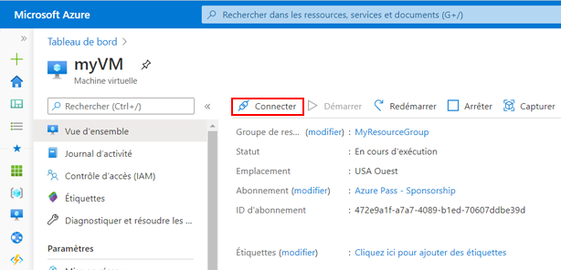
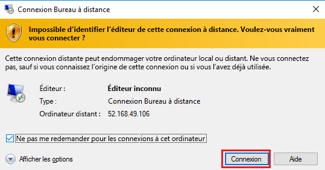
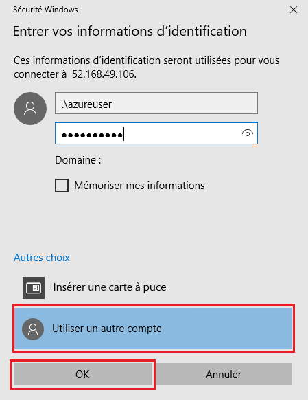
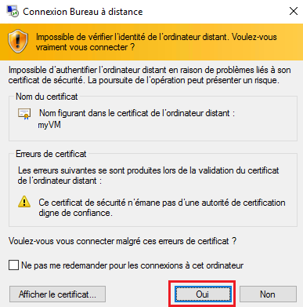
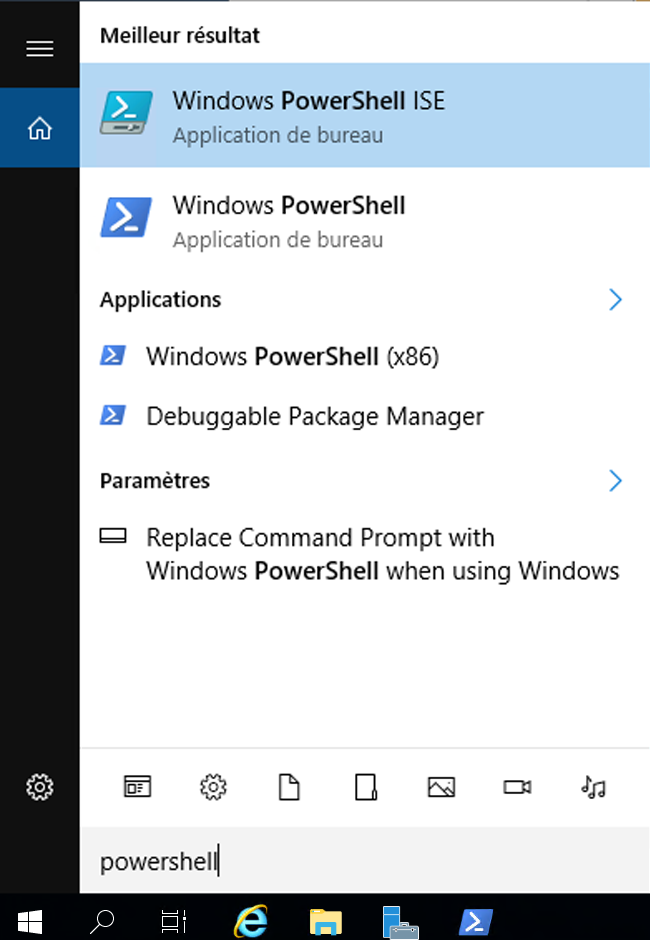
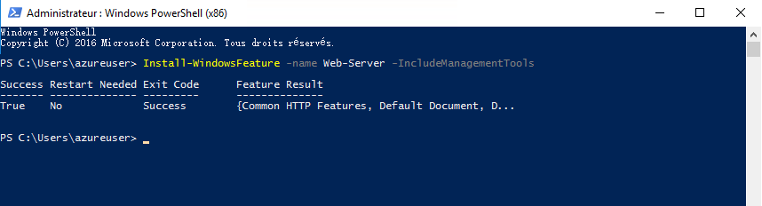
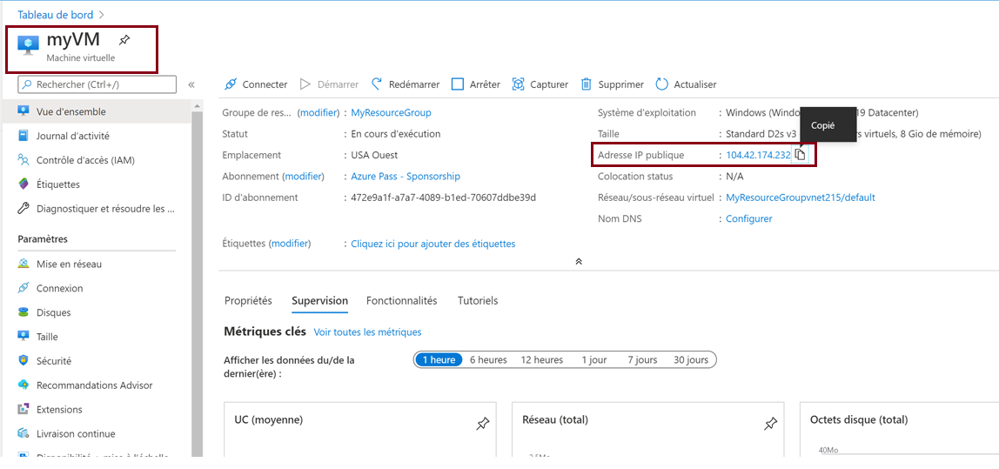
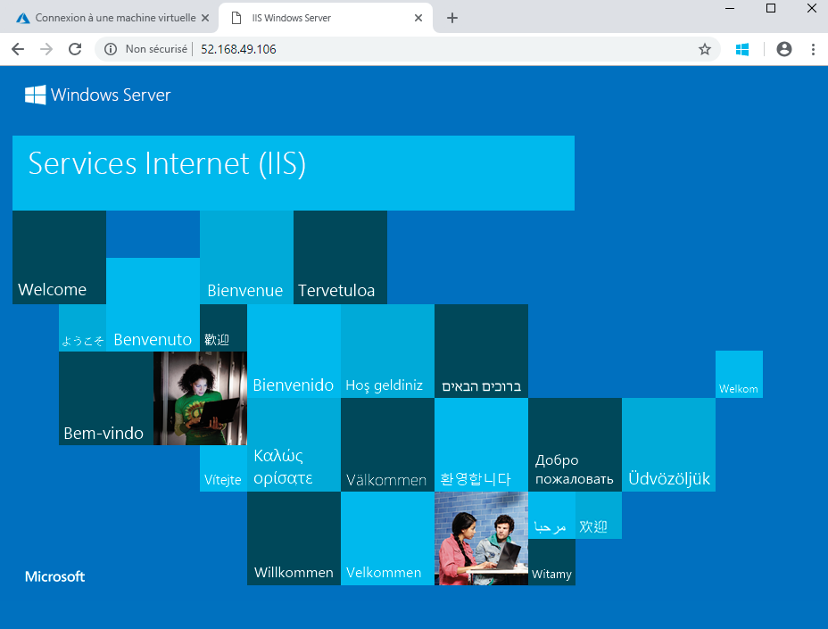

---
wts:
    title: '01 - Créer une machine virtuelle dans le portail (10 min)'
    module: 'Module 02 - Principaux services Azure (charges de travail)'
---
# 01 - Créer une machine virtuelle dans le portail

Au cours de cette procédure pas à pas, nous allons créer une machine virtuelle dans le portail Azure, nous connecter à cette machine virtuelle, installer le rôle Serveur web et effectuer un test. 

**Remarque** : Au cours de cette procédure pas à pas, prenez le temps de lire les informations en cliquant sur les icônes correspondantes. 

# Tâche 1 : Création de la machine virtuelle (10 min)

Au cours de cette tâche, nous allons créer une machine - Gen1 virtuelle de centre de données Windows Server 2019. 

1. Connectez-vous au [Portail Azure à l’adresse https://portal.azure.com](https://portal.azure.com?azure-portal=true).

2. Dans le panneau **Tous les services**, recherchez et sélectionnez **Machines virtuelles**, puis cliquez sur **+ Ajouter** et choisissez **+Machine virtuelle** .

3. Sous l’onglet **Informations de base**, renseignez les informations suivantes (conservez les valeurs par défaut pour toutes les autres options) :

    | Paramètres | Valeurs |
    |  -- | -- |
    | Abonnement | **Choisissez votre abonnement**|
    | Groupe de ressources | **myRGVM** (à créer) |
    | Nom de la machine virtuelle | **myVm** |
    | Lieu | **(USA) USA Est**|
    | Image | **Windows Server 2019 Datacenter - Gen1**|
    | Taille | Standard D2s v3|
    | Nom d’utilisateur du compte d’administrateur | **azureuser** |
    | Mot de passe du compte d’administrateur | **Pa$$w0rd1234**|
    | Règles des ports d’entrée - Autoriser les ports sélectionnés | **RDP (3389)** et **HTTP (80)**|
    | | |

4. Accédez à l'onglet Réseau et recherchez **Sélectionner des ports d’entrée** :

    | Paramètres | Valeurs |
    | -- | -- |
    | Sélectionner des ports d’entrée | **HTTP (80), RDP (3389)**|
    | | |

    **Remarque** - Vérifiez si les ports 80 et 3389 sont sélectionnés

5. Accédez à l’onglet Gestion. Dans la section **Surveillance**, sélectionnez le paramètre suivant :

    | Paramètres | Valeurs |
    | -- | -- |
    | Diagnostics de démarrage | **Désactiver**|
    | | |

6. Conservez les autres valeurs par défaut, puis cliquez sur le bouton **Examiner et créer** au bas de la page.

7. Une fois la validation réussie, cliquez sur le bouton **Créer**. Le déploiement de la machine virtuelle peut prendre de cinq à sept minutes.

8. Vous recevrez les mises à jour sur la page de déploiement et dans la zone **de notification** (icône représentant une cloche dans le menu supérieur).

* **Vérifiez si les ports 80 et 3389 sont ouverts**

# Tâche 2 : Connexion à la machine virtuelle

Dans cette tâche, nous allons nous connecter à notre nouvelle machine virtuelle à l’aide de RDP. 

1. Recherchez **myVM** et sélectionnez votre nouvelle machine virtuelle.

    **Remarque** : Vous pouvez également utiliser le lien **Accéder à la ressource** sur la page de déploiement ou le lien de la ressource dans la zone de **notification**.

2. Dans le panneau **Vue d’ensemble** de la machine virtuelle, cliquez sur le bouton **Se connecter** et choisissez **RDP**.

    

    **Remarque** : Les instructions suivantes indiquent comment vous connecter à votre machine virtuelle à partir d’un ordinateur Windows. Sur un Mac, vous avez besoin d’un client RDP tel que le client Bureau à distance disponible sur le Mac App Store. Sur un ordinateur Linux, vous pouvez utiliser un client RDP open source.

2. Sur la page **Se connecter à la machine virtuelle**, conservez les options par défaut pour vous connecter avec l’adresse IP publique sur le port 3389, puis cliquez sur **Télécharger le fichier RDP**.

3. **Ouvrez** le fichier RDP téléchargé, puis cliquez sur **Se connecter** quand vous y êtes invité. 

    

4. Dans la fenêtre **Sécurité de Windows**, sélectionnez **Autres choix**, puis **Utiliser un autre compte**. Indiquez le nom d’utilisateur (.\azureuser) et le mot de passe (Pa$$w0rd1234). Cliquez sur **OK** pour vous connecter.

    

5. Un avertissement de certificat peut s’afficher pendant le processus de connexion. Cliquez sur **Oui** pour créer la connexion et vous connecter à votre machine virtuelle déployée. La connexion devrait être établie avec succès.

    

Félicitations ! Vous avez déployé une machine virtuelle Windows Server dans Azure et vous y êtes connecté

# Tâche 3 : Installez le rôle serveur Web et testez-le

Dans cette tâche, installez le rôle serveur Web sur le serveur et assurez-vous que la page d’accueil IIS par défaut peut être affichée.

1. Ouvrez une invite de commandes PowerShell sur la machine virtuelle. Pour cela, cliquez sur le bouton **Démarrer**, tapez **PowerShell**, cliquez avec le bouton droit sur **Windows PowerShell**, puis, dans le menu contextuel, sélectionnez **Exécuter en tant qu’administrateur**.

    

2. Installez la fonctionnalité **Serveur Web** dans la machine virtuelle en exécutant la commande ci-dessous dans l’invite de commandes PowerShell. Vous pouvez copier et coller cette commande.

    ```PowerShell
    Install-WindowsFeature -name Web-Server -IncludeManagementTools
    ```
  
3. Une fois la commande exécutée, un message de **réussite** s’affiche avec la valeur **True**. Vous n’avez pas besoin de redémarrer la machine virtuelle pour terminer l’installation. Fermez la connexion RDP à la machine virtuelle.

    

4. Dans le portail, accédez de nouveau au panneau **Vue d’ensemble** de myVM, utilisez le bouton **Copier dans le Presse-papiers** pour copier l’adresse IP publique de myVM, ouvrez un nouvel onglet de navigateur, collez l’adresse IP publique dans la zone de texte URL, puis appuyez sur la touche **Entrée** pour y accéder.

    

5. La page d’accueil par défaut du serveur web IIS s’affiche.

    

Félicitations ! Vous avez créé un serveur Web accessible via son adresse IP publique. Si vous aviez une application web à héberger, vous pourriez déployer les fichiers de l’application sur la machine virtuelle et les héberger sur la machine virtuelle déployée pour qu’ils soient accessibles au public.


**Remarque** : Pour éviter des coûts supplémentaires, vous pouvez supprimer ce groupe de ressources. Recherchez des groupes de ressources, cliquez sur votre groupe de ressources, puis sur **Supprimer le groupe de ressources**. Vérifiez le nom du groupe de ressources, puis cliquez sur **Supprimer**. Consultez les **notifications** afin de vérifier que la suppression a bien été effectuée. 
