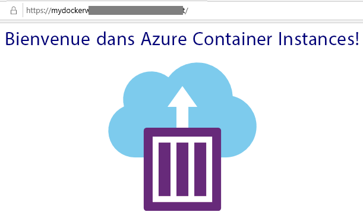

---
wts:
    title: '02 - Créer une application Web (10 min)'
    module: 'Module 02 - Principaux services Azure (charges de travail)'
---
# 02 - Créer une application web

Dans cette procédure pas à pas, nous allons créer une nouvelle application web qui exécute un conteneur Docker. Le conteneur affiche un message de bienvenue. 

# Tâche 1 : Créer une application web (10 min)

Azure App Service est en fait un ensemble de quatre services, tous conçus pour vous aider à héberger et exécuter des applications Web. Les quatre services (Web Apps, Mobile Apps, API Apps et Logic Apps) sont différents, mais au final, ils fonctionnent tous de manière très similaire. Les Web Apps sont les plus couramment utilisées des quatre services, et c’est le service que nous utiliserons dans ce labo.

Dans cette tâche, vous allez créer une application Web Azure App Service. 

1. Connectez-vous au [portail Azure](http://portal.azure.com/). 

2. Dans le panneau **Tous les services**, recherchez et sélectionnez **App Services** et cliquez sur **+ Ajouter**

3. Sous l’onglet **Base** du panneau **Web App**, spécifiez les paramètres suivants (remplacez **xxxx** dans le nom de l’application web avec des lettres et des chiffres afin que le nom soit unique). Conservez les valeurs par défaut pour tous les autres éléments, y compris le plan App Service. 

    | Paramètre | Valeur |
    | -- | -- |
    | Abonnement | **Choisir votre abonnement** |
    | Groupe de ressources | **myRGWebApp1** (créer un nouveau) |
    | Nom | **myDockerWebAppxxxx** |
    | Publier | **Conteneur Docker** |
    | Système d'exploitation | **Linux** |
    | Région | **Est des États-Unis** (ignorez les avertissements de disponibilité du plan de service) |
    | | |	
    
    **Remarque** - Veillez à modifier la valeur **xxxx** pour créer un **Nom** unique

4. Cliquez sur **Suivant > Docker** et configurez les informations sur le conteneur. La commande start-up est facultative et n’est pas nécessaire dans cet exercice. 

    **Remarque :** Il s'agit du même conteneur qui a été utilisé dans la procédure pas à pas des Container Instances pour afficher un message Hello World. 

    | Paramètre | Valeur |
    | -- | -- |
    | Options | **Conteneur unique** |
    | Source d’image | **Docker Hub** |
    | Type d’accès | **Public** |
    | Image et étiquette | **microsoft/aci-helloworld** |
    | | |	

5. Cliquez sur **Examiner et créer**, puis cliquez sur **Créer**. 

# Tâche 2 : Testez l’application Web

Dans cette tâche, nous allons tester l’application Web.

1. Attendez que le déploiement de l’application web soit terminé.

2. Dans la zone **Notifications**, cliquez sur **Accéder à la ressource**. 

3. Sur le panneau **Aperçu**, localisez l'entrée **URL**. 

    

4. Cliquez sur l’**URL** pour ouvrir le nouvel onglet du navigateur et afficher la page Bienvenue dans les Azure Container Instances.

    

5. Revenez au panneau **Aperçu** de votre application Web et notez qu’il comprend plusieurs graphiques. Si vous répétez l'étape 4 plusieurs fois, vous verrez la télémétrie correspondante affichée dans les graphiques. Cela comprend le nombre de demandes et le temps de réponse moyen. 

**Remarque** : Pour éviter des coûts supplémentaires, vous pouvez supprimer ce groupe de ressources. Recherchez des groupes de ressources, cliquez sur votre groupe de ressources, puis sur **Supprimer le groupe de ressources**. Vérifiez le nom du groupe de ressources, puis cliquez sur **Supprimer**. Surveillez les **notifications** pour voir comment se déroule la suppression.

