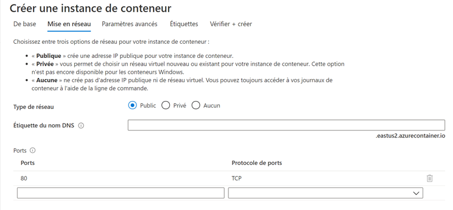
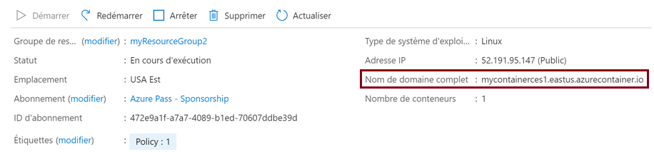
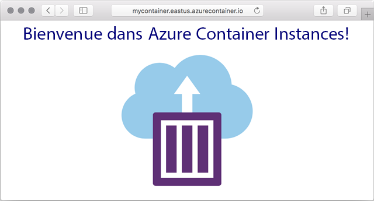

---
wts:
    title: '02 - Déployer Azure Container Instances'
    module: 'Module 02 - Services de base d’Azure'
---

# 02 - Déployer Azure Container Instances

Dans cette procédure pas à pas, nous allons créer, configurer et déployer un conteneur Docker à l’aide d’ACI (Azure Container Instances) dans le portail Azure. Le conteneur est une application web Welcome to ACI qui affiche une page HTML statique. 

# Tâche 1 : Créer une instance de conteneur

Dans cette tâche, nous allons créer une nouvelle instance de conteneur pour l’application web. 

1. Connectez-vous au [portail Azure](https://portal.azure.com).

2. Dans le panneau **Tous les services**, recherchez et sélectionnez **Instances de conteneur** puis cliquez sur **+ Ajouter**. 

3. Fournissez les détails de base suivants pour la nouvelle instance de conteneur (laissez les valeurs par défaut pour tous les autres éléments) : 

	| Paramètre| Valeur|
	|----|----|
	| Abonnement | **Choisissez votre abonnement** |
	| Groupe de ressources | **myRGContainer** (créer un nouveau) |
	| Nom du conteneur| **mycontainer**|
	| Région | **Est des États-Unis** |
	| Source d’image| **Docker Hub ou autre registre**|
	| Type d’image| **Publique**|
	| Image| **microsoft / aci-helloworld**|
	| Type de système d’exploitation| **Linux** |
	| Taille| ***Laissez la valeur par défaut***|
	|||

4. Configurez l’onglet Mise en réseau (remplacez **xxxx** par des lettres et des chiffres pour obtenir un nom unique au monde). Conservez les valeurs par défaut pour tous les autres paramètres.

	| Paramètre| Valeur|
	|--|--|
	| Étiquette de nom DNS| **mycontainerdnsxxxx** |
	|||
	
	**Remarque**: Votre conteneur sera accessible au public à l’adresse : dns-name-label.region.azurecontainer.io. Si vous recevez un message d’erreur du type **Étiquette de nom DNS non disponible** après le déploiement, spécifiez une autre étiquette de nom DNS et recommencez le processus de déploiement.

	

5. Cliquez sur **Vérifier et créer** pour lancer le processus de validation automatique.

6. Cliquez sur **Créer** pour créer l’instance de conteneur. 

7. Surveillez la page Déploiement et la page **Notifications**. 

8. Pendant que vous attendez, regardez cet [exemple de code derrière cette application simple](https://github.com/Azure-Samples/aci-helloworld). Parcourez le dossier \app. 

# Tâche 2 : Vérifier le déploiement de l’instance de conteneur

Dans cette tâche, nous vérifions que l’instance de conteneur est en cours d’exécution, en nous assurant que la page d’accueil s’affiche.

1. Une fois le déploiement terminé, cliquez sur le lien **Accéder à la ressource** sur le panneau de déploiement ou sur le lien vers la ressource dans la zone de notification.

2. Dans le panneau **Aperçu** de **mycontainer**, assurez-vous que le **Statut** de votre conteneur est bien **En cours d’exécution**. 

3. Recherchez le nom de domaine complet (Fully Qualified Domain Name ou FQDN).

	

2. Copiez le nom de domaine complet du conteneur dans la zone de texte URL du navigateur Web et appuyez sur **Entrée**. La page d’accueil devrait s’afficher. 

	

**Remarque**: Vous pouvez également utiliser l’adresse IP du conteneur dans votre navigateur. 

Félicitations ! Vous avez utilisé Azure Portal pour déployer avec succès une application sur un conteneur dans Azure Container Instance.

**Remarque**: Pour éviter des coûts supplémentaires, vous pouvez supprimer ce groupe de ressources. Recherchez des groupes de ressources, cliquez sur votre groupe de ressources, puis sur **Supprimer le groupe de ressources**. Vérifiez le nom du groupe de ressources, puis cliquez sur **Supprimer**. Surveillez les **notifications** pour voir comment se déroule la suppression.
