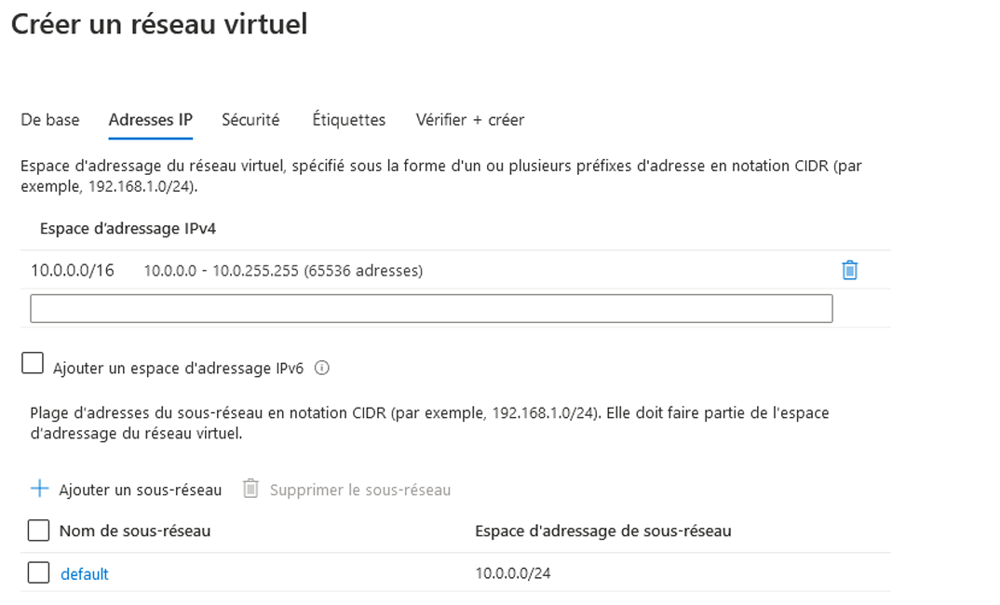
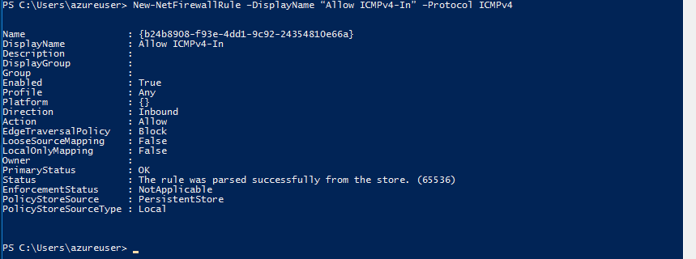

---
wts:
    title: '04 - Créer un réseau virtuel (20 min)'
    module: 'Module 02 - Principaux services Azure (charges de travail)'
---
# 04 - Créer un réseau virtuel

Dans cette procédure pas à pas, nous allons créer un réseau virtuel, déployer deux machines virtuelles sur ce réseau virtuel, puis les configurer pour permettre à une machine virtuelle d’envoyer une requête ping à l’autre au sein de ce réseau virtuel.

# Tâche 1 : Créer un réseau virtuel (20 min)

Dans cette tâche, nous allons créer un réseau virtuel. 

1. Connectez-vous au Portail Azure à l’adresse <a href="https://portal.azure.com" target="_blank"><span style="color: #0066cc;" color="#0066cc">https://portal.azure.com</span></a>

2. Dans le panneau **Tous les services**, recherchez et sélectionnez **Réseaux virtuels**, puis cliquez sur **+ Ajouter**. 

3. Dans le panneau, **Créer un réseau virtuel**, remplissez les valeurs suivantes (laissez les valeurs par défaut pour tous autres éléments) :

    | Paramètre | Valeur | 
    | --- | --- |
    | Nom | **vnet1** |
    | Espace d’adressage |**10.1.0.0/16** |
    | Abonnement | **Sélectionner votre abonnement** |
    | Groupe de ressources | **myRGVNet** (créer un nouveau) |
    | Lieu | **(États-Unis) USA Est** |
    | Sous-réseau - Nom | **par défaut** |
    | Plage d’adresses de sous-réseau | **10.1.0.0/24** |

    
    

5. Cliquez sur le bouton **Examiner et créer**. Assurez-vous que la validation a abouti.

6. Cliquez sur le bouton **Créer** pour déployer le réseau virtuel. 

    **Remarque** : Dans votre organisation, comment saurez-vous de quels réseaux virtuels et adresses IP vous aurez besoin ?

# Tâche 2 : Créer deux machines virtuelles

Dans cette tâche, nous allons créer deux machines virtuelles dans le réseau virtuel. 

1. Dans le panneau **Tous les services**, recherchez **Machines virtuelles** puis cliquez sur **+ Ajouter**. 

2. Sous l’onglet **Informations de base**, renseignez les informations suivantes (conservez les valeurs par défaut pour toutes les autres options) :

   | Paramètre | Valeur | 
   | --- | --- |
   | Abonnement | **Choisir votre abonnement**  |
   | Groupe de ressources |  **myRGVNet** |
   | Nom de la machine virtuelle | **vm1**|
   | Région | **(États-Unis) USA Est** |
   | Image | **Windows Server 2019 Datacenter** |
   | Nom d’utilisateur| **azureuser** |
   | Mot de passe| **Pa$$w0rd1234** |
   | Ports d’entrée publics| Sélectionnez **Autoriser les ports sélectionnés**  |
   | Ports d’entrée sélectionnés| **RDP (3389)** |
   |||

3. Sélectionnez l’onglet **Réseaux**. Assurez-vous que la machine virtuelle est placée dans le réseau virtuel vnet1. Vérifiez les paramètres par défaut, mais n’apportez aucune autre modification. 

   | Paramètre | Valeur | 
   | --- | --- |
   | Réseau virtuel | **vnet1** |
   |||

4. Cliquez sur **Examiner et créer**. Une fois la validation réussie, cliquez sur **Créer**. La durée du déploiement peut varier, mais elle est généralement de trois à six minutes.

5. Surveillez votre déploiement, mais passez à l’étape suivante. 

6. Créez une seconde machine virtuelle en répétant les étapes **2 à 4** ci-dessus. Veillez à utiliser un autre nom de machine virtuelle. Assurez-vous aussi que la machine virtuelle se trouve dans le même réseau virtuel et qu’elle utilise une nouvelle adresse IP publique :

    | Paramètre | Valeur |
    | --- | --- |
    | Groupe de ressources | **myRGVNet** |
    | Nom de la machine virtuelle |  **vm2** |
    | Réseau virtuel | **vnet1** |
    | Adresse IP publique | (nouveau) **vm2-ip** |
    |||

7. Attendez la fin du déploiement des deux machines virtuelles. 

# Tâche 3 : Tester la connexion 

Au cours de cette tâche, nous allons autoriser les connexions ICMP et tester si les machines virtuelles peuvent communiquer (ping) entre elles. 

1. Dans le panneau **Toutes les ressources**, recherchez **vm1**, ouvrez le panneau **Vue d’ensemble** correspondant, puis assurez-vous que son **État** est **En cours d’exécution**. Vous devrez peut-être **actualiser** la page.

2. Dans le panneau **Vue d’ensemble**, cliquez sur le bouton **Se connecter**.

    **Remarque** : Les instructions suivantes indiquent comment vous connecter à votre machine virtuelle à partir d’un ordinateur Windows. 

3. Dans le panneau **Se connecter à la machine virtuelle**, conservez les options par défaut pour vous connecter avec une adresse IP sur le port 3389, puis cliquez sur **Télécharger le fichier RDP**.

4. Ouvrez le fichier RDP téléchargé, puis cliquez sur **Se connecter** quand vous y êtes invité. 

5. Dans la fenêtre **Sécurité de Windows**, tapez le nom d’utilisateur **azureuser** et le mot de passe **Pa$$w0rd1234**, puis cliquez sur **OK**.

6. Un avertissement de certificat peut s’afficher pendant le processus de connexion. Cliquez sur **Oui** pour créer la connexion et vous connecter à votre machine virtuelle déployée. La connexion devrait être établie avec succès.

7. Ouvrez une invite de commandes PowerShell sur la machine virtuelle. Pour cela, cliquez sur le bouton **Démarrer**, tapez **PowerShell**, cliquez avec le bouton droit sur **Windows PowerShell**, puis, dans le menu contextuel, cliquez sur **Exécuter en tant qu’administrateur**

8. Effectuez un test ping de vm2 (assurez-vous que vm2 est en cours d’exécution). Un message d’erreur s’affiche pour signaler que le délai d’attente de la demande est dépassé.  Le test ping échoue, car il utilise le **protocole ICMP (Internet Control Message Protocol)**. Par défaut, le protocole ICMP n’est pas autorisé par le pare-feu Windows.


   ```PowerShell
   ping vm2
   ```
   
   

    **Remarque** : Vous allez à présent ouvrir une session Bureau à distance vers vm2 et autoriser les connexions ICMP entrantes

9. Connectez-vous à **vm2** au moyen du protocole RDP. Vous pouvez suivre les étapes **2 à 6**.

10. Ouvrez une invite **PowerShell** et autorisez ICMP. Cette commande autorise les connexions ICMP entrantes via le pare-feu Windows.

   ```PowerShell
   New-NetFirewallRule –DisplayName “Allow ICMPv4-In” –Protocol ICMPv4
   ```
   

   **Remarque** : Vous allez à présent basculer vers la session Bureau à distance vers vm1 et réexécuter le test ping

11. Revenez à la session Bureau à distance vers vm1 et réexécutez le test ping. Le test devrait à présent réussir. 

   ```PowerShell
   ping vm2
   ```

Félicitations ! Vous avez configuré et déployé deux machines virtuelles dans un réseau virtuel. Vous avez également configuré le Pare-feu Windows pour que l’une des machines virtuelles autorise les demandes ping entrantes. 

**Remarque** : Pour éviter des coûts supplémentaires, vous pouvez supprimer ce groupe de ressources. Recherchez des groupes de ressources, cliquez sur votre groupe de ressources, puis sur **Supprimer le groupe de ressources**. Vérifiez le nom du groupe de ressources, puis cliquez sur **Supprimer**. Surveillez les **notifications** pour voir comment se déroule la suppression.
