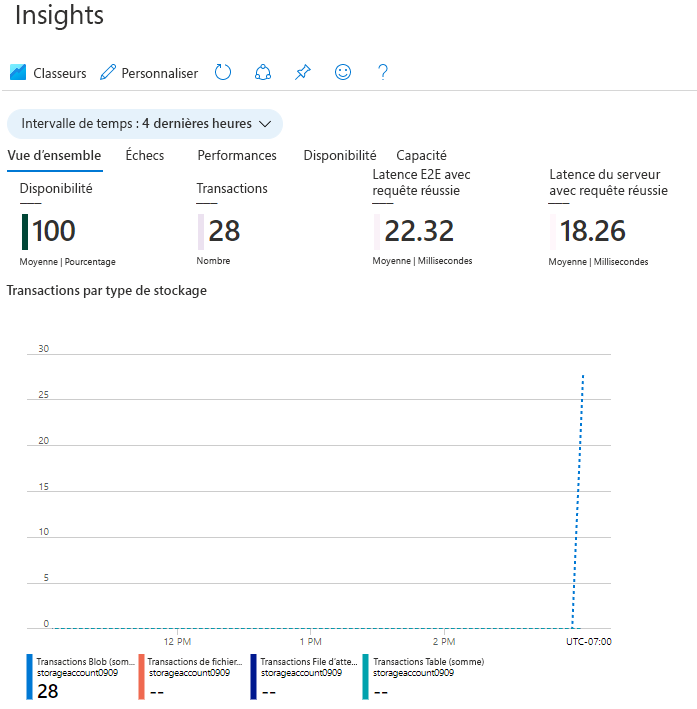

---
wts :
    title: '05 - Créer un stockage d’objets blob (5 min)'
    module: 'Module 02 - Principaux services Azure (charges de travail)'
---
# 05 - Créer un stockage d’objets blob

Dans cette procédure pas à pas, nous allons créer un compte de stockage, puis travailler avec des fichiers de stockage d’objets blob.

# Tâche 1 : Créer un compte de stockage (5 min)

Dans cette tâche, vous allez créer un nouveau compte de stockage. 

1. Connectez-vous au Portail Azure à l’adresse <a href="https://portal.azure.com" target="_blank">https://portal.azure.com</a>

2. Dans le panneau **Tous les services**, recherchez et sélectionnez **Comptes de stockage**, puis cliquez sur **Ajouter**. 

3. Sous l’onglet **Informations de base** du panneau **Créer un compte de stockage**, remplissez les informations suivantes (remplacez **xxxx** dans le nom du compte de stockage par des lettres et des chiffres de sorte que le nom soit unique au monde). Laissez les valeurs par défaut pour tous les autres éléments.

    | Paramètre | Valeur | 
    | --- | --- |
    | Abonnement | **Choisir votre abonnement** |
    | Groupe de ressources | **myRGStorage** (créer un nouveau) |
    | Nom du compte de stockage | **storageaccountxxxx** |
    | Lieu | **(États-Unis) USA Est**  |
    | Performances | **Standard** |
    | Type de compte | **StorageV2 (usage général v2)** |
    | Réplication | **Stockage localement redondant (LRS)** |
    | | |

    **Remarque** - Veillez à modifier la valeur **xxxx** pour créer un **Nom de compte de stockage** unique

5. Cliquez sur **Examiner et créer** pour réviser les paramètres de votre compte de stockage et autoriser Azure à valider la configuration. 

6. Une fois validé, cliquez sur **Créer**. Attendez de recevoir la notification indiquant que le compte a bien été créé. 

7. Sur la page d’accueil, recherchez et sélectionnez **Comptes de stockage** et vérifiez que votre nouveau compte de stockage est répertorié.

    

# Tâche 2 : Utiliser le stockage Blob

Dans cette tâche, nous allons créer un conteneur blob et charger un fichier d’objet blob. 

1. Cliquez sur le nom du nouveau compte de stockage, défilez jusqu’à la section **Service BLOB**, puis cliquez sur **Conteneurs**.

2. Cliquez sur **Conteneur** et complétez les informations. Utilisez les icônes Information pour en savoir plus. Lorsque vous avez terminé, cliquez sur **OK**.

    | Paramètre | Valeur |
    | --- | --- |
    | Nom | **container1**  |
    | Niveau d'accès public| **Privé (aucun accès anonyme)** |
    | | |

    

4. Cliquez sur le conteneur **container1**, puis sur **Charger**.

5. Accédez à un fichier sur votre ordinateur local. 

    **Remarque** : Vous pouvez créer un fichier vide `.txt` ou utiliser n’importe quel fichier existant. Pensez à choisir un fichier de petite taille pour réduire le temps de chargement.

6. Cliquez sur la flèche **Avancée**, laissez les valeurs par défaut mais passez en revue les options disponibles, puis cliquez sur **Charger**.

    **Remarque** : Vous pouvez charger autant de blobs que vous le souhaitez de cette façon. De nouveaux blobs seront répertoriés dans le conteneur.

7. Une fois le fichier chargé, cliquez avec le bouton droit sur le fichier et notez les options comprenant Afficher/modifier, Télécharger, Propriétés et Supprimer. 

8. Si vous avez du temps, depuis le panneau de compte de stockage, passez en revue les options pour les fichiers, les tables et les files d’attente.

# Tâche 3 : Surveillez le compte de stockage

1. Si nécessaire, revenez au panneau de compte de stockage et cliquez sur **Diagnostiquer et résoudre les problèmes**. 

2. Découvrez certains des problèmes de stockage les plus courants. Notez qu’il existe plusieurs utilitaires de résolution des problèmes.

3. Dans le panneau du compte de stockage, défilez vers le bas jusqu’à la section **Surveillance**, puis cliquez sur **Insights**. Notez qu’il existe des informations sur les pannes, les performances, la disponibilité et la capacité. Vos informations seront différentes.

    

Félicitations ! Vous avez créé un compte de stockage, puis travaillé avec des objets blob de stockage.

**Remarque** : Pour éviter des coûts supplémentaires, vous pouvez supprimer ce groupe de ressources. Recherchez des groupes de ressources, cliquez sur votre groupe de ressources, puis sur **Supprimer le groupe de ressources**. Vérifiez le nom du groupe de ressources, puis cliquez sur **Supprimer**. Surveillez les **notifications** pour voir comment se déroule la suppression.
