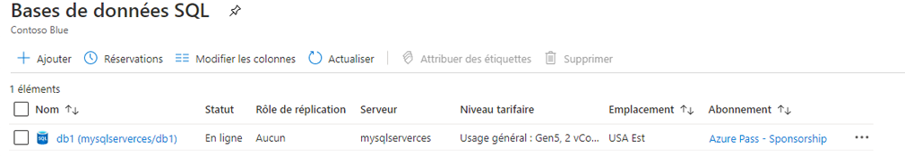

---
wts:
    title: '05 - Créer une base de données SQL'
    module: 'Module 02 - Services principaux Azure'
---

# 05 - Créer une base de données SQL

Dans cette procédure pas à pas, nous allons créer une base de données SQL dans Azure, puis interroger les données de celle-ci.

# Tâche 1 : Créer la base de données

Au cours de cette tâche, vous allez créer une base de données SQL basée sur l'exemple de base de données AdventureWorksLT. 

1. Connectez-vous au Portail Azure à l'adresse [**https://portal.azure.com**](https://portal.azure.com).

2. Dans le panneau **Tous les services**, recherchez et sélectionnez **Bases de données SQL**, puis cliquez sur **Ajouter**. 

3. Sur l’onglet **Base**, remplissez ces informations.  

    | Paramètre | Valeur | 
    | --- | --- |
    | Abonnement | **Choisissez votre abonnement** |
    | Groupe de ressources | **myRGDb** (créer nouveau) |
    | Nom de la base de données| **db1** | 
    | | |

3. En regard de la liste déroulante **Serveur**, cliquez sur **Créer nouveau** et saisissez ces informations (remplacez **xxxx** dans le nom du serveur par des lettres et des chiffres afin que le nom soit unique). Cliquez sur **OK** lorsque vous avez terminé.

    | Paramètre | Valeur | 
    | --- | --- |
    | Nom du serveur | **sqlserverxxxx** (doit être unique) | 
    | Connexion à l’administration du serveur | **sqluser** |
    | Mot de passe | **Pa$$w0rd1234** |
    | Emplacement | **Est des États-Unis** |
    | Autorisez les services Azure à accéder au serveur| ***Activez la case à cocher*** |
    | | |

   

4. Accédez à l'onglet **Mise en réseau** et configurez les paramètres suivants (conserver les valeurs par défaut pour tous les autres éléments) 

    | Paramètre | Valeur | 
    | --- | --- |
    | Méthode de connectivité | **Point de terminaison public** |    
    | Autorisez les services et les ressources Azure à accéder à ce serveur | **Oui** |
    | Ajoutez l’adresse IP actuelle du client | **Non** |
    | | |
    
   

5. Allez à l’onglet **Paramètres supplémentaires**. Nous allons utiliser l’exemple de base de données AdventureWorksLT.

    | Paramètre | Valeur | 
    | --- | --- |
    | Utiliser les données existantes | **Échantillon** |
    | Classement | ***utilisation par défaut*** |
    | Activez Advanced Data Security | **Pas maintenant** |
    | | |

    

6. Cliquez sur **Examiner et créer** puis cliquez sur **Créer** pour déployer et approvisionner le groupe de ressources, le serveur et la base de données. Le déploiement peut prendre jusqu'à 5 minutes.

7. Surveillez votre déploiement. 

# Tâche 2 : Testez la base de données.

Dans cette tâche, nous allons configurer le serveur SQL et exécuter une requête SQL. 

1. À partir du panneau **Tous les services**, recherchez et sélectionnez **Bases de données SQL** et assurez-vous que votre nouvelle base de données a été créée. Vous devrez peut-être **Actualiser** la page.

    

2. Cliquez sur l'entrée **db1** représentant la base de données SQL que vous avez créée, puis cliquez sur **Éditeur de requête (aperçu)**.

3. Connectez-vous en tant que **sqluser** avec le mot de passe **Pa$$w0rd1234**.

4. Vous ne pourrez pas vous connecter. Lisez attentivement l’erreur et notez l’adresse IP qui doit être autorisée via le pare-feu. 

    

5. À partir du panneau **db1**, cliquez sur **Aperçu**. 

    

6. Depuis le panneau **Aperçu** du serveur SQL, cliquez sur **Définir le pare-feu du serveur**.

7. Cliquez sur **Ajouter l’IP du client** (barre de menu supérieure) pour ajouter l’adresse IP référencée dans le message d’erreur. Veillez à **Enregistrer** vos modifications. 

    

8. Retournez à votre base de données SQL et à la page de connexion **Éditeur de requête (aperçu)**. Essayez de vous reconnecter en tant que **sqluser** avec le mot de passe **Pa$$w0rd1234**. Cette fois, vous devriez y arriver. Notez que le déploiement de la nouvelle règle de pare-feu peut prendre quelques minutes. 

9. Une fois que vous vous êtes connecté avec succès, le volet de requête apparaît. Saisissez ensuite la requête suivante dans le volet de l'éditeur.

    ```SQL
    SELECT TOP 20 pc.Name as CategoryName, p.name as ProductName
    FROM SalesLT.ProductCategory pc
    JOIN SalesLT.Product p
    ON pc.productcategoryid = p.productcategoryid;
    ```

    

10. Cliquez sur **Exécuter**, puis examinez les résultats de la requête dans le volet **Résultats**. La requête doit s’exécuter correctement.

    

Félicitations ! Vous avez créé une base de données SQL dans Azure et interrogé avec succès les données de cette base de données.

**Remarque**: Pour éviter des coûts supplémentaires, vous pouvez supprimer ce groupe de ressources. Recherchez des groupes de ressources, cliquez sur votre groupe de ressources, puis sur **Supprimer le groupe de ressources**. Vérifiez le nom du groupe de ressources, puis cliquez sur **Supprimer**. Surveillez les **notifications** pour voir comment se déroule la suppression.
