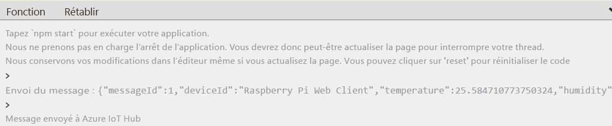

---
wts:
    title: '06 - Implémenter un hub IoT Azure'
    module: 'Module 02 - Services de base d’Azure'
---
# 06 - Implémenter un hub IoT Azure

Dans cette procédure pas à pas, nous allons configurer un nouveau hub IoT Azure dans le portail Azure, puis authentifier une connexion à un appareil IoT à l’aide du simulateur d’appareil Raspberry Pi en ligne. Les données et les messages des capteurs sont transmis du simulateur Raspberry Pi à votre hub IoT Azure. Vous pouvez afficher des mesures pour l’activité de messagerie dans le portail Azure.

# Tâche 1 : Créer un hub IoT 

Dans cette tâche, nous allons créer un hub IoT. 

1. Connectez-vous au [portail Azure](https://portal.azure.com).

2. Dans le panneau **Tous les services**, recherchez et sélectionnez **hub IoT** puis cliquez sur **+ Ajouter**.

3. Sous l’onglet **Général** du panneau **Hub IoT**, remplissez les champs avec les détails suivants (remplacez **xxxx** dans le nom du compte de stockage par des lettres et des chiffres, de façon à ce que le nom soit unique au monde) :

    | Paramètres | Valeur |
    |--|--|
    | Abonnement | **Choisissez votre abonnement** |
    | Groupe de ressources |  **myRGIoT** (créer un nouveau)|
    | Région | **USA Est** |
    | Nom de l’hub IoT | **my-hub-groupxxxx** |
    | | |	

4. Déplacez-vous dans l’onglet **Taille et échelle**, utilisez la liste déroulante pour définir **Prix appliqués et niveau d’échelle** sur **S1 : Niveau standard**. 

5. Cliquez sur le bouton **Examiner et créer**.

6. Cliquez sur le bouton **Créer** pour commencer à créer votre nouvelle instance hub IoT Azure.

7. Attendez que l’instance hub IoT Azure soit déployée. 

# Tâche 2 : Ajouter un appareil IoT

Dans cette tâche, nous allons ajouter un appareil IoT au hub IoT. 

1. Une fois le déploiement terminé, cliquez sur **Aller à la ressource** dans le panneau de déploiement. Une autre solution consiste, à partir du panneau **Tous les services**, à rechercher et sélectionner **hub IoT** et à localiser votre nouvelle instance hub IoT

	

2. Pour ajouter un nouvel appareil IoT, faites défiler vers la bas jusqu’à la section **Explorateurs**, puis cliquez sur **Appareils IoT**. Ensuite, cliquez sur **+ Nouveau**.

	

3. Donnez un nom à votre nouvel appareil IoT, **myRaspberryPi**, puis cliquez sur le bouton **Enregistrer**. Cette opération crée une identité d’appareil IoT dans votre hub IoT Azure.

4. Si vous ne voyez pas votre nouvel appareil, **actualisez** la page Appareils IoT. 

5. Sélectionnez **myRaspberryPi** et copiez la valeur **Chaîne de connexion principale**. Vous utiliserez cette clé dans la tâche suivante pour authentifier une connexion auprès du simulateur Raspberry Pi.

	

# Tâche 3 : Tester l’appareil à l’aide du simulateur Raspberry Pi

Dans cette tâche, nous allons tester notre appareil à l’aide du simulateur Raspberry Pi. 

1. Ouvrez un nouvel onglet dans le navigateur web et accédez au [simulateur Raspberry Pi en ligne](https://azure-samples.github.io/raspberry-pi-web-simulator/#Getstarted). 

2. Découvrez le simulateur Raspberry Pi. Si une fenêtre contextuelle d’aperçu s’affiche, cliquez sur « **X** » pour fermer la fenêtre.

3. Dans la zone de code, à droite, recherchez la ligne contenant 'const connectionString ='. Remplacez ce code par la chaîne de connexion que vous avez copiée à partir du portail Azure. Notez que la chaîne de connexion comprend les entrées DeviceId (**myRaspberryPi**) et SharedAccessKey.

	

4. Cliquez sur **Exécuter** (sous la zone de code) pour exécuter l’application. La sortie de la console doit afficher les données du capteur et les messages qui sont envoyés du simulateur Raspberry Pi à votre hub IoT Azure. Les données et les messages sont envoyés à chaque fois que la LED du simulateur Raspberry Pi clignote. 

	

5. Cliquez sur **Arrêter** pour interrompre l’envoi de données.

6. Retournez au portail Azure et à votre hub IoT.

7. Accédez au panneau **Vue d’ensemble** du hub IoT et faites défiler vers le bas jusqu’aux informations d’**utilisation du hub IoT**.

	

Félicitations ! Vous avez configuré le hub IoT Azure pour collecter les données des capteurs à partir d’un appareil IoT.

**Remarque**: Pour éviter des coûts supplémentaires, vous pouvez supprimer ce groupe de ressources. Recherchez des groupes de ressources, cliquez sur votre groupe de ressources, puis sur **Supprimer le groupe de ressources**. Vérifiez le nom du groupe de ressources, puis cliquez sur **Supprimer**. Surveillez les **notifications** pour voir comment se déroule la suppression.
