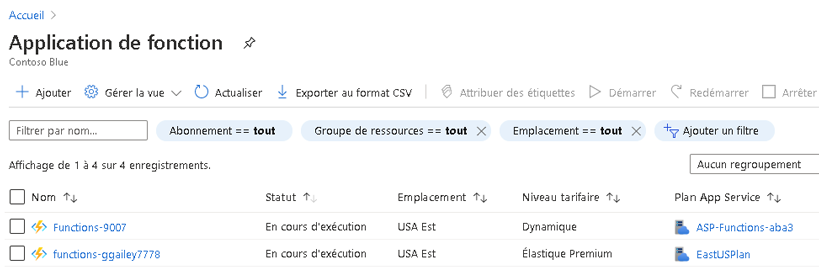
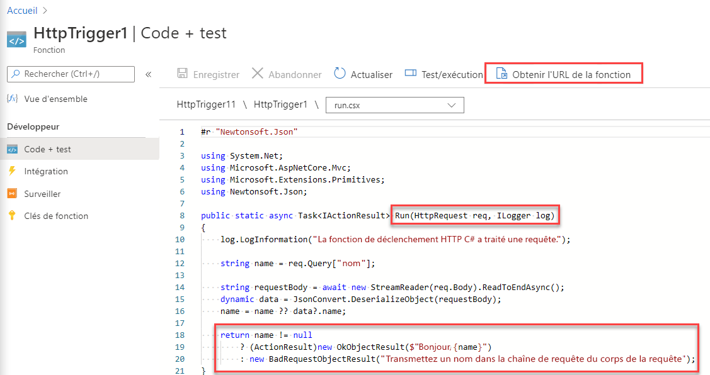
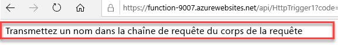
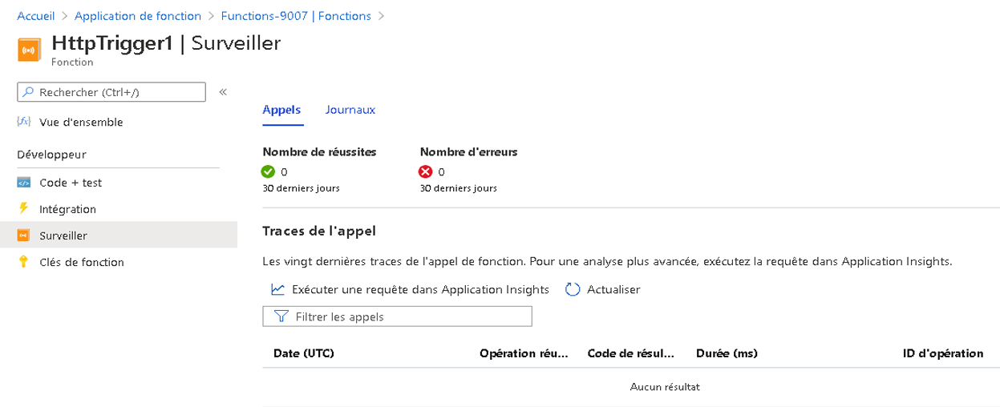

---
wts:
    title: '07 - Implémenter des fonctions Azure'
    module: 'Module 02 - Services de base d’Azure'
---
# 07 - Implémenter des fonctions Azure

Dans cette procédure pas à pas, nous allons créer une application de fonction pour afficher un message Hello en cas de requête HTTP. 

# Tâche 1 : Créer une application de fonction

Dans cette tâche, nous allons créer une application de fonction.

1. Connectez-vous au [portail Azure](https://portal.azure.com).

1. Dans la zone de texte située en haut du portail **Rechercher des ressources, des services et des documents**, recherchez et sélectionnez **Application de fonction** puis, dans le panneau **Function App**, cliquez sur **Ajouter**.

1. Sur l’onglet **De base** du panneau **Application de fonction**, spécifiez les paramètres suivants (remplacez **xxxx** dans le nom de la fonction avec des lettres et des chiffres de façon à ce que le nom soit global unique et laissez tous les autres paramètres avec leurs valeurs par défaut) : 

    | Paramètres | Valeur |
    | -- | --|
    | Abonnement | Nom de votre abonnement Azure |
    | Groupe de ressources | Nom d’un nouveau groupe de ressources **myRGFunction** |
    | Nom de l’application de fonction | **fonction-xxxx** |
    | Publier | **Code** |
    | Pile d’exécution | **NET Core** |
    | Région | **USA Est** |
    | | |	

1. Cliquez sur **Examiner et créer** puis, après la validation, cliquez sur **Créer** pour commencer l’approvisionnement et le déploiement de votre nouvelle application de fonction Azure.

1. Attendez la notification indiquant que la ressource a bien été créée.

1. Revenez au panneau **Application de fonction**, cliquez sur **Rafraîchir** et vérifiez que l’application de fonction nouvellement créée a le statut **En cours d’exécution**. 

    

# Tâche 2 : Créer une fonction déclenchée par requête HTTP et la tester

Dans cette tâche, nous allons utiliser la fonction Webhook + API pour afficher un message en cas de requête HTTP. 

1. Sur le panneau **Application de fonction**, cliquez sur l’application de fonction nouvellement créée. 

1. Sur le panneau de l’application de fonction, dans la section **Fonctions**, sur **Fonctions** puis cliquez sur **+ Ajouter**.

    

1. Sous l’onglet **Modèles** du panneau **Nouvelle fonction**, cliquez sur **Déclencheur HTTP**. 

    

1. Sous l’onglet **Détails** du panneau **Nouvelle fonction**, acceptez le nom par défaut de la **Nouvelle fonction** et le **Niveau d’autorisation**, puis cliquez sur **Créer une fonction**. 

    

1. Dans le panneau **HttpTrigger1**, dans la section **Développeur**, cliquez sur **Code + Test**. 

1. Sur le panneau **HttpTrigger1 \| Code + Test**, examinez le code généré automatiquement et notez que le code est conçu pour exécuter une requête HTTP et les informations du journal. Notez également que la fonction renvoie un message de type Hello avec un nom. 

    

1. Cliquez sur **Obtenir l’URL de la fonction** dans la partie supérieure de l’éditeur de fonctions. 

1. Assurez-vous que la valeur de la liste déroulante **Clé** est définie sur **Par défaut** et cliquez sur **Copier** pour copier l’URL de la fonction. 

    

1. Ouvrez un nouvel onglet de navigateur et collez l’URL de la fonction copiée dans la barre d’adresse de votre navigateur Web. Lorsque la page sera demandée, la fonction s’exécutera. Notez le message renvoyé indiquant que la fonction nécessite un nom dans le corps de la demande.

    

1. Ajoutez **&name=*votre_nom*** à la fin de l’URL.

    **Remarque** : remplacez ***votre_nom*** par votre prénom. Par exemple, si vous vous appelez Cindy, l’URL finale ressemblera à `https://azfuncxxx.azurewebsites.net/api/HttpTrigger1?code=X9xx9999xXXXXX9x9xxxXX==&name=cindy`

    

1. Lorsque votre fonction s’exécute, chaque invocation est tracée. Pour afficher les traces dans le portail Azure, revenez sur **HttpTrigger1 \|** Panneau **Code + Test** et cliquez sur **Contrôler**.

     

Félicitations ! Vous avez créé une application de fonction pour afficher un message Hello en cas de requête HTTP. 

**Remarque**: Pour éviter des coûts supplémentaires, vous pouvez supprimer ce groupe de ressources. Recherchez des groupes de ressources, cliquez sur votre groupe de ressources, puis sur **Supprimer le groupe de ressources**. Vérifiez le nom du groupe de ressources, puis cliquez sur **Supprimer**. Surveillez les **notifications** pour voir comment se déroule la suppression.
