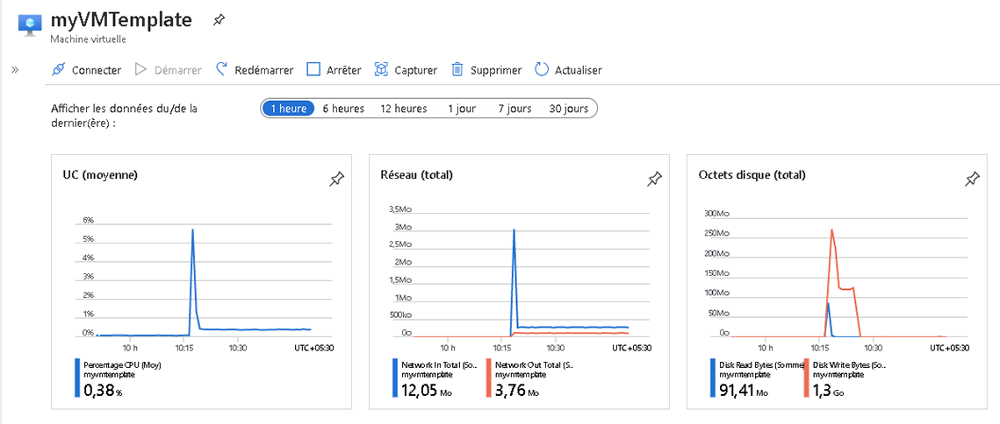

---
wts:
    title: '09 - Création d’une machine virtuelle avec un modèle'
    module: 'Module 02 - Services de base d’Azure'
---
# 09 - Créer une machine virtuelle avec un modèle

Dans cette procédure pas à pas, nous allons déployer une machine virtuelle avec un modèle de démarrage rapide et examiner ses capacités de surveillance.

# Tâche 1 : Découvrez la galerie et trouvez un modèle

Dans cette tâche, nous allons parcourir la galerie de démarrage rapide Azure et déployer un modèle qui crée une machine virtuelle. 

1. Dans un navigateur, accédez à la [Galerie de modèles de démarrage rapide Azure](https://azure.microsoft.com/resources/templates?azure-portal=true). Dans la galerie, vous trouverez un certain nombre de modèles courants et récemment mis à jour. Ces modèles automatisent le déploiement des ressources Azure, y compris l’installation de packages logiciels courants.

2. Parcourez les différents types de modèles disponibles. 

    **Remarque**: Y a-t-il des modèles qui vous intéressent ?

3. Recherchez le modèle [Déployer une machine virtuelle Windows simple](https://azure.microsoft.com/resources/templates/101-vm-simple-windows?azure-portal=true) ou accédez-y directement.

    **Remarque**: Le bouton **Déployer sur Azure** vous permet de déployer le modèle via le portail Azure. Lors d’un tel déploiement, vous serez invité uniquement à définir un ensemble limité de paramètres de configuration. 

4. Cliquez sur le bouton **Déployer sur Azure**. Votre session de navigateur sera automatiquement redirigée vers le [portail Azure](http://portal.azure.com/).

5. Si vous y êtes invité, connectez-vous à l’abonnement Azure que vous souhaitez utiliser dans ce labo.

6. Cliquez sur **Modifier le modèle**. Le format de modèle Resource Manager utilise le format JSON. Vérifiez les variables et recherchez le nom de la machine virtuelle. Changez le nom en **myVMTemplate**. **Sauvegardez** vos modifications. Vous êtes redirigé vers le panneau **Déploiement personnalisé** dans le portail Azure.

    

7. Sur le panneau **Déploiement personnalisé**, configurez les paramètres requis par le modèle (remplacez ***xxxx*** dans le préfixe d’étiquette DNS par des lettres et des chiffres, de sorte que l’étiquette soit unique au monde). Conservez les valeurs par défaut pour tous les autres éléments. 

    | Paramètre| Valeur|
    |----|----|
    | Abonnement | **Choisissez votre abonnement**|
    | Groupe de ressources | **myRGTemplate** (créer un nouveau) |
    | Emplacement | **Est des États-Unis** |
    | Nom d’utilisateur administrateur | **azureuser** |
    | Mot de passe administrateur | **Pa$$w0rd1234** |
    | Préfixe d’étiquette DNS | **myvmtemplate*xxxx*** |
    | Version de système d’exploitation Windows | **2019-Datacenter** |
    | | |

8. Activez la case à cocher **J’accepte les termes et conditions énoncés ci-dessus** puis cliquez sur **Acheter**.

    **Remarque**: Il n’y a pas de coûts associés à l’utilisation de ce modèle.

9. Surveillez votre déploiement. 

# Tâche 2 : Vérifiez et contrôlez le déploiement de votre machine virtuelle

Dans cette tâche, nous allons vérifier si la machine virtuelle s’est correctement déployée. 

1. Dans le panneau **Tous les services**, recherchez et sélectionnez **Machines virtuelles**.

2. Assurez-vous que votre nouvelle machine virtuelle a été créée. 

    

3. Sélectionnez votre machine virtuelle et sur le volet **Vue d’ensemble**, faites défiler vers le bas pour afficher les données de surveillance.

    **Remarque**: Le délai de surveillance peut être ajusté, de une heure à 30 jours.

4. Passez en revue les différents graphiques fournis, y compris **UC (moyenne)**, **Réseau (total)**, et **Octets de disque (total)**. 

    

5. Cliquez sur un graphique. Remarquez que vous pouvez **ajouter une métrique** et modifier le type de graphique. Vous avez le temps de tester cette fonctionnalité. 

6. Revenez au panneau **Vue d’ensemble**.

7. Cliquez sur le **journal d’activité** (volet gauche). Les journaux d’activité enregistrent des événements tels que la création ou la modification de ressources. 

8. Cliquez sur **Ajouter un filtre** et recherchez différents types d’événements et d’opérations afin de vous familiariser avec cette option. 

    

**Remarque**: Pour éviter des coûts supplémentaires, vous pouvez supprimer ce groupe de ressources. Recherchez des groupes de ressources, cliquez sur votre groupe de ressources, puis sur **Supprimer le groupe de ressources**. Vérifiez le nom du groupe de ressources, puis cliquez sur **Supprimer**. Surveillez les **notifications** pour voir comment se déroule la suppression.
