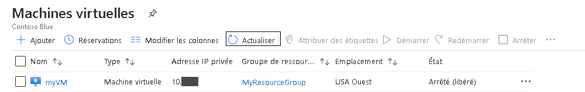
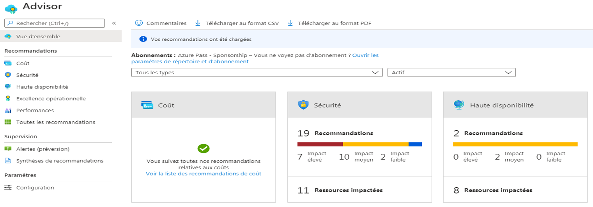
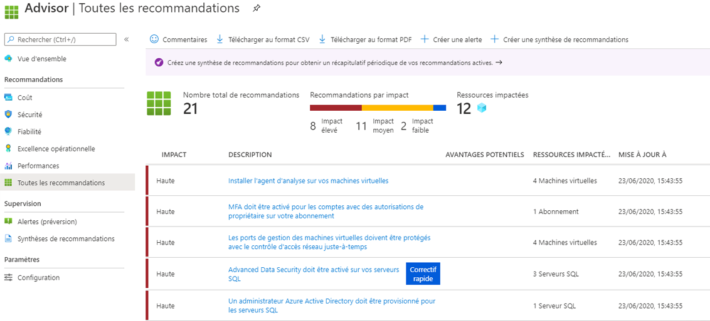

---
wts :
    title: '10 - Créer une machine virtuelle avec PowerShell (10 min)'
    module: 'Module 03 : Décrire les solutions de base et les outils de gestion dans Azure'
---
# 10 - Créer une machine virtuelle avec PowerShell

Dans cette procédure pas à pas, nous allons configurer Cloud Shell, utiliser le module Azure PowerShell pour créer un groupe de ressources et une machine virtuelle et enfin, passer en revue les suggestions d’Azure Advisor. 

# Tâche 1 : Configurer Cloud Shell (10 min)

Dans cette tâche, nous allons configurer Cloud Shell. 

1. Connectez-vous au [portail Azure](https://portal.azure.com).

2. Dans le portail Azure, ouvrez **Azure Cloud Shell** en cliquant sur l’icône en haut à droite du portail Azure.

    

3. Si vous avez déjà utilisé Cloud Shell, passez à la tâche suivante. 

4. Lorsque vous êtes invité à sélectionner **Bash** ou **PowerShell**, sélectionnez **PowerShell**.

5. Lorsque vous y êtes invité, cliquez sur **Créer l’espace de stockage** et attendez que Azure Cloud Shell s’initialise. 

# Tâche 2 : Créer un groupe de ressources et une machine virtuelle

Dans cette tâche, nous allons utiliser PowerShell pour créer un groupe de ressources et une machine virtuelle.  

1. Vérifiez que **PowerShell** est sélectionné dans le menu déroulant en haut à gauche du volet Cloud Shell.

2. Dans la session PowerShell, dans le volet Cloud Shell, créez un groupe de ressources. 

    ```PowerShell
    New-AzResourceGroup -Name myRGPS -Location EastUS
    ```

3. Vérifiez votre nouveau groupe de ressources. 

    ```PowerShell
    Get-AzResourceGroup | Format-Table
    ```

4. Créez une machine virtuelle. Lorsque vous y êtes invité, indiquez le nom d’utilisateur (**azureuser**) et le mot de passe (**Pa$$w0rd1234**) qui seront configurés en tant que compte administrateur local sur ces machines virtuelles. N’oubliez pas d’inclure les caractères accent grave (`) à la fin de toutes les lignes, à l’exception de la dernière. (Il ne doit pas y avoir de caractères accent grave si vous tapez la commande entière sur une seule ligne.)

    ```PowerShell
    New-AzVm `
    -ResourceGroupName "myRGPS" `
    -Name "myVMPS" `
    -Location "East US" `
    -VirtualNetworkName "myVnetPS" `
    -SubnetName "mySubnetPS" `
    -SecurityGroupName "myNSGPS" `
    -PublicIpAddressName "myPublicIpPS"
    ```
** Attendez le déploiement de la VM avant de fermer PowerShell

5. Fermez le volet Cloud Shell de la session PowerShell.

6. Dans le portail Azure, recherchez les **machines virtuelles** et vérifiez que **myVMPS** est en cours d’exécution. Cette opération peut prendre quelques minutes.

    

7. Accédez à la nouvelle machine virtuelle et passez en revue les paramètres Vue d’ensemble et Réseaux pour vérifier que vos informations ont été correctement déployées. 

# Tâche 3 : Exécuter des commandes dans Cloud Shell

Dans cette tâche, nous nous entraînerons à exécuter des commandes PowerShell à partir de Cloud Shell. 

1. Dans le portail Azure, ouvrez **Azure Cloud Shell** en cliquant sur l’icône en haut à droite du portail Azure.

2. Vérifiez que **PowerShell** est sélectionné dans le menu déroulant en haut à gauche du volet Cloud Shell.

3. Accédez aux informations concernant votre machine virtuelle, notamment le nom, le groupe de ressources, l’emplacement et l’état. Notez que PowerState indique **Exécution en cours**.

    ```PowerShell
    Get-AzVM -name myVMPS -status | Format-Table -autosize
    ```

4. Arrêtez la machine virtuelle. À l’invite, confirmez (Oui) l’action. 

    ```PowerShell
    Stop-AzVM -ResourceGroupName myRGPS -Name myVMPS
    ```

5. Vérifiez l’état de votre machine virtuelle. PowerState devrait maintenant indiquer **Désalloué**. Vous pouvez également vérifier l’état de la machine virtuelle dans le portail. 

    ```PowerShell
    Get-AzVM -name myVMPS -status | Format-Table -autosize
    ```

# Tâche 4 : Consultation des suggestions d’Azure Advisor

**Remarque :** Cette même tâche se trouve dans le labo Créer une machine virtuelle avec Azure CLI. 

Dans cette tâche, nous allons passer en revue les suggestions d’Azure Advisor pour notre machine virtuelle. 

1. Dans le panneau **Tous les services**, recherchez et sélectionnez **Advisor**. 

2. Dans le panneau **Advisor**, sélectionnez **Vue d’ensemble**. Les suggestions sont regroupées par haute disponibilité, sécurité, niveau de performance et coût. 

    

3. Sélectionnez **Toutes les suggestions** et prenez le temps de consulter toutes les suggestions et actions suggérées. 

    **Remarque :** Selon vos ressources, vos suggestions seront différentes. 

    

4. Notez que vous pouvez télécharger les suggestions au format CSV ou PDF. 

5. Notez que vous pouvez créer des alertes. 

6. Si vous avez le temps, continuez à expérimenter Azure PowerShell. 

Félicitations ! Vous avez configuré Cloud Shell, créé une machine virtuelle à l’aide de PowerShell, utilisé des commandes PowerShell et consulté les suggestions Advisor.

**Remarque** : Pour éviter des coûts supplémentaires, vous pouvez supprimer ce groupe de ressources. Recherchez des groupes de ressources, cliquez sur votre groupe de ressources, puis sur **Supprimer le groupe de ressources**. Vérifiez le nom du groupe de ressources, puis cliquez sur **Supprimer**. Surveillez les **notifications** pour voir comment se déroule la suppression.
