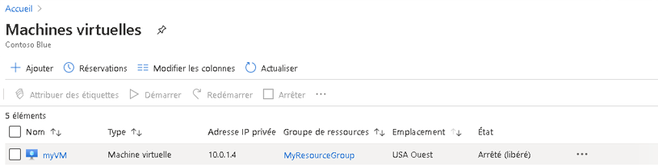
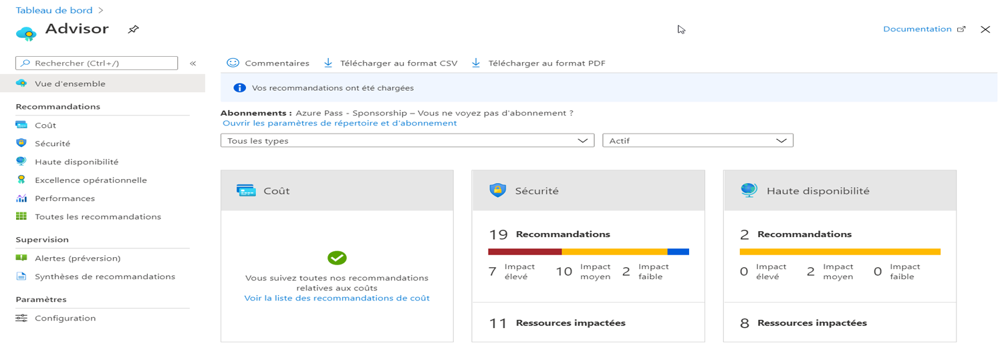
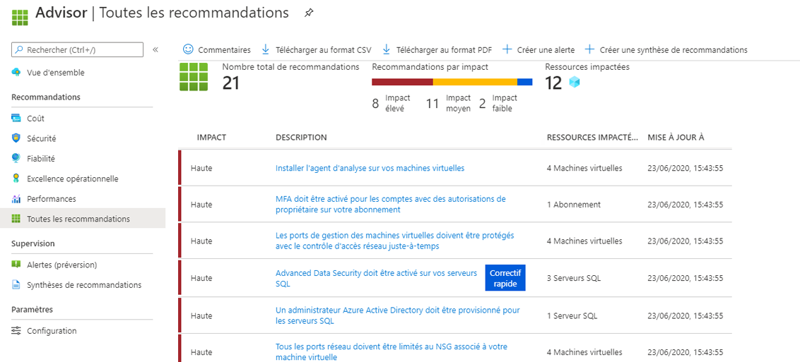

---
wts:
    title: '11 - Créer une machine virtuelle avec la CLI (10 min)'
    module: 'Module 03 : Décrire les solutions de base et les outils de gestion dans Azure'
---
# 11 - Créer une machine virtuelle avec la CLI

Dans cette procédure pas à pas, nous allons configurer Cloud Shell, utiliser Azure CLI pour créer un groupe de ressources et une machine virtuelle, et passer en revue les recommandations Azure Advisor. 

# Tâche 1 : Configurer Cloud Shell (10 min)

Dans cette tâche, nous allons configurer Cloud Shell. 

1. Connectez-vous au [portail Azure](https://portal.azure.com).

2. Dans le portail Azure, ouvrez **Azure Cloud Shell** en cliquant sur l’icône en haut à droite du portail Azure.

    

3. Si vous avez déjà utilisé Cloud Shell, passez à la tâche suivante. 

4. Lorsque vous êtes invité à sélectionner **Bash** ou **PowerShell**, sélectionnez **Bash**. 

5. Lorsque vous y êtes invité, cliquez sur **Créer l’espace de stockage** et attendez que Azure Cloud Shell s’initialise. 

# Tâche 2 : Créer un groupe de ressources et une machine virtuelle

Dans cette tâche, nous utiliserons Azure CLI pour créer un groupe de ressources et une machine virtuelle.  

1. Assurez-vous que **Bash** est sélectionné dans le menu déroulant supérieur gauche du volet Cloud Shell. Si ce n’est pas le cas, sélectionnez-le.

    

2. Dans la session Bash, dans le volet Cloud Shell, créez un nouveau groupe de ressources. 

    ```cli
    az group create --name myRGCLI --location EastUS
    ```

3. Vérifiez que le groupe de ressources a été créé.

    ```cli
    az group list --output table
    ```

4. Créez une nouvelle machine virtuelle Assurez-vous que chaque ligne, à l’exception de la dernière, est suivie de la barre oblique inverse (`\`). Si vous tapez la commande entière sur la même ligne, n’utilisez pas la barre oblique inverse. 

    ```cli
    az vm create \
    --name myVMCLI \
    --resource-group myRGCLI \
    --image UbuntuLTS \
    --location EastUS \
    --admin-username azureuser \
    --admin-password Pa$$w0rd1234
    ```

    >**Remarque** : Si vous utilisez la ligne de commande sur un ordinateur Windows, remplacez le caractère barre oblique inverse (`\`) par le caractère caret (`^`).
    
    **Remarque**: La commande sera terminée en 2 à 3 minutes. La commande créera une machine virtuelle et diverses ressources associées, telles que des ressources de stockage, de mise en réseau et de sécurité. Ne passez pas à l’étape suivante tant que le déploiement de la machine virtuelle n’est pas terminé. 

5. Une fois la commande exécutée, dans la fenêtre du navigateur, fermez le volet Cloud Shell.

6. Dans le portail Azure, recherchez **Machines virtuelles** et vérifiez si **myVMCLI** est bien en cours d’exécution.

    


# Tâche 3 : Exécuter des commandes dans le service Cloud Shell

Dans cette tâche, nous nous entraînerons à exécuter des commandes CLI à partir de Cloud Shell. 

1. Dans le portail Azure, ouvrez **Azure Cloud Shell** en cliquant sur l’icône en haut à droite du portail Azure.

2. Assurez-vous que **Bash** est sélectionné dans le menu déroulant en haut à gauche du volet Cloud Shell.

3. Récupérez des informations sur la machine virtuelle que vous avez approvisionnée, notamment son nom, son groupe de ressources, son emplacement et son état. Notez que PowerState indique **Exécution en cours**.

    ```cli
    az vm show --resource-group myRGCLI --name myVMCLI --show-details --output table 
    ```

4. Arrêtez la machine virtuelle. Un message vous indique que la facturation se poursuit jusqu’à ce que la machine virtuelle soit désallouée. 

    ```cli
    az vm stop --resource-group myRGCLI --name myVMCLI
    ```

5. Vérifiez l’état de votre machine virtuelle. L’état d’alimentation devrait maintenant être **arrêté**.

    ```cli
    az vm show --resource-group myRGCLI --name myVMCLI --show-details --output table 
    ```

# Tâche 4 : Consultation des suggestions d’Azure Advisor

Dans cette tâche, nous passerons en revue les recommandations d’Azure Advisor.

   **Remarque :** Si vous avez terminé le labo précédent (Créer une machine virtuelle avec PowerShell), vous avez déjà effectué cette tâche. 

1. Dans le panneau **Tous les services**, recherchez et sélectionnez **Advisor**. 

2. Dans le panneau **Advisor**, sélectionnez **Vue d’ensemble**. Les suggestions sont regroupées par haute disponibilité, sécurité, niveau de performance et coût. 

    

3. Sélectionnez **Toutes les suggestions** et prenez le temps de consulter toutes les suggestions et actions suggérées. 

    **Remarque :** Selon vos ressources, vos suggestions seront différentes. 

    

4. Notez que vous pouvez télécharger les suggestions au format CSV ou PDF. 

5. Notez que vous pouvez créer des alertes. 

6. Si vous avez le temps, continuez à expérimenter Azure CLI. 

Félicitations ! Vous avez configuré Cloud Shell, créé une machine virtuelle à l’aide d’Azure CLI, pratiqué l’utilisation des commandes Azure CLI et consulté les recommandations Advisor.

**Remarque**: Pour éviter des coûts supplémentaires, vous pouvez supprimer ce groupe de ressources. Recherchez des groupes de ressources, cliquez sur votre groupe de ressources, puis sur **Supprimer le groupe de ressources**. Vérifiez le nom du groupe de ressources, puis cliquez sur **Supprimer**. Surveillez les **notifications** pour voir comment se déroule la suppression.
