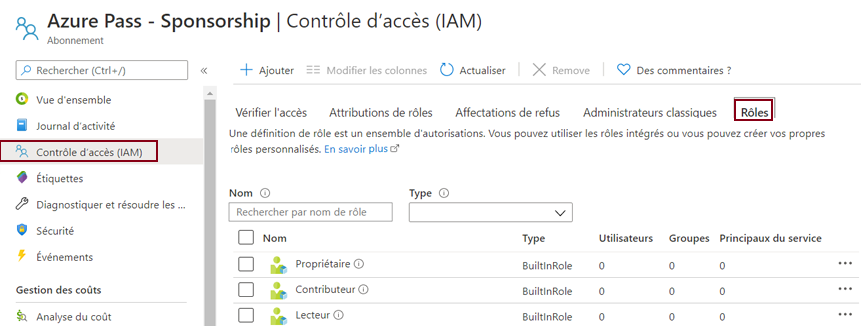
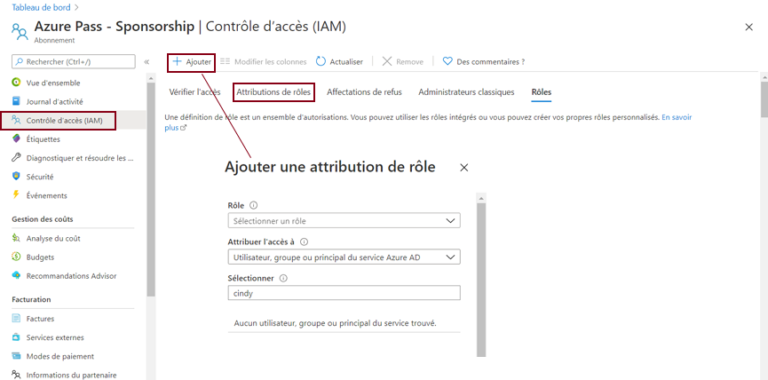
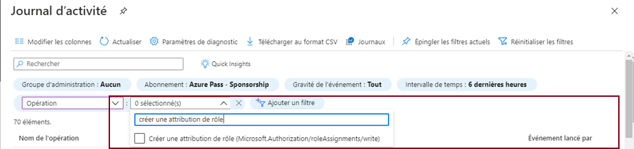

---
wts:
    title: '15 - Gérer l’accès avec RBAC'
    module: 'Module 03 - Sécurité, confidentialité, conformité et fiabilité'
---
# 15 - Gérer l’accès avec RBAC

Dans cette procédure pas à pas, nous allons attribuer des rôles et afficher des journaux d’activité. 

# Tâche 1 : Afficher et attribuer des rôles

Dans cette tâche, nous allons attribuer le rôle de contributeur de machine virtuelle. 

1. Connectez-vous au [portail Azure](https://portal.azure.com).

2. Dans le panneau **Tous les services**, recherchez et sélectionnez **Groupes de ressources**, puis cliquez sur **+ Ajouter**.

3. Créez un nouveau groupe de ressources. Lorsque vous avez terminé, cliquez sur **Créer**. 

    | Paramètre | Valeur |
    | -- | -- |
    | Abonnement | **Choisissez votre abonnement** |
    | Groupe de ressources | **myRGRBAC** |
    | Région | **(US) USA Est** |
    | | |

4. Créez **Contrôler + créer** puis cliquez sur **Créer**.

5. **Actualisez** la page du groupe de ressources et cliquez sur l’entrée représentant le groupe de ressources nouvellement créé.

6. Cliquez sur le panneau **Contrôle d’accès (IAM)**, puis passez à l’onglet **Rôles**. Faites défiler le grand nombre de définitions de rôles disponibles. Utilisez les icônes d’informations pour vous faire une idée des autorisations de chaque rôle. Notez qu’il existe également des informations sur le nombre d’utilisateurs et de groupes affectés à chaque rôle.

    

7. Sous l’onglet **Attributions de rôle** du panneau **myRGRBAC - Contrôle d'accès (IAM)**, cliquez sur **+ Ajouter** puis cliquez sur **Ajouter une attribution de rôle**. Assignez le rôle Contributeur de machine virtuelle à votre compte d’utilisateur, puis cliquez sur **Enregistrer**. 

    | Paramètre | Valeur |
    | -- | -- |
    | Rôle | **Contributeur de machine virtuelle** |
    | Octroyer l’accès à | **Utilisateur, groupe ou principal de service Azure AD** |
    | Sélectionnez | votre compte d’utilisateur |
    | | |

    **Remarque :** Le rôle de contributeur de machine virtuelle vous permet de gérer des machines virtuelles, mais pas d’accéder à leur système d’exploitation ni de gérer le réseau virtuel et le compte de stockage auxquels ils sont connectés.

    

8. **Rafraîchissez** la page Affectations des rôle et assurez-vous que vous êtes désormais répertorié en tant que contributeur de machine virtuelle. 

    **Remarque**: Cette affectation ne vous octroie en fait aucun privilège supplémentaire, car votre compte a déjà le rôle Propriétaire, qui inclut tous les privilèges associés au rôle Contributeur.

# Tâche 2 : Contrôler les attributions de rôles et supprimer un rôle

Dans cette tâche, nous allons afficher le journal d’activité pour vérifier l’attribution de rôle, puis supprimer le rôle. 

1. Sur le panneau Groupes de ressources myRGRBAC, cliquez sur **Journal d’activité**.

2. Cliquez sur **Ajouter un filtre**, sélectionnez **Opération**, puis **Créer une attribution de rôle**.

    

3. Vérifiez que le journal d’activité affiche votre attribution de rôle. 

    **Remarque**: Pouvez-vous comprendre comment supprimer votre attribution de rôle ?

Félicitations ! Vous avez attribué des rôles et affiché des journaux d’activité. 

**Remarque**: Pour éviter des coûts supplémentaires, vous pouvez supprimer ce groupe de ressources. Recherchez des groupes de ressources, cliquez sur votre groupe de ressources, puis sur **Supprimer le groupe de ressources**. Vérifiez le nom du groupe de ressources, puis cliquez sur **Supprimer**. Surveillez les **notifications** pour voir comment se déroule la suppression.

