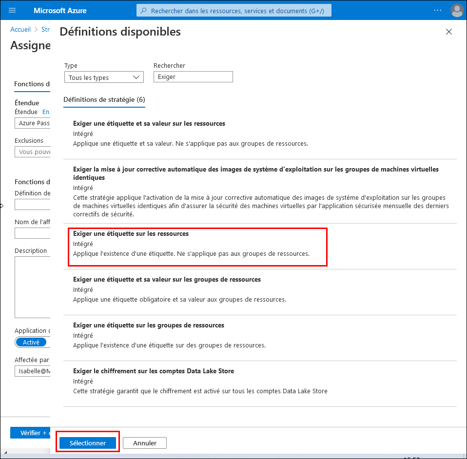
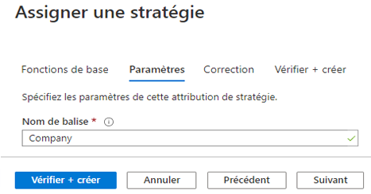
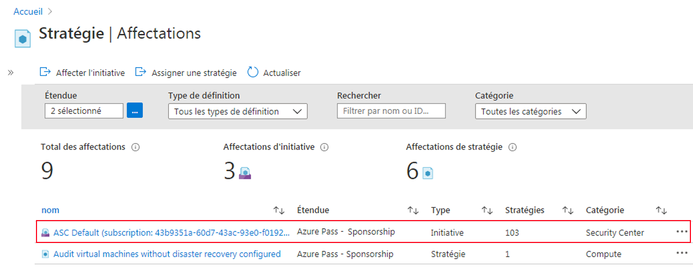
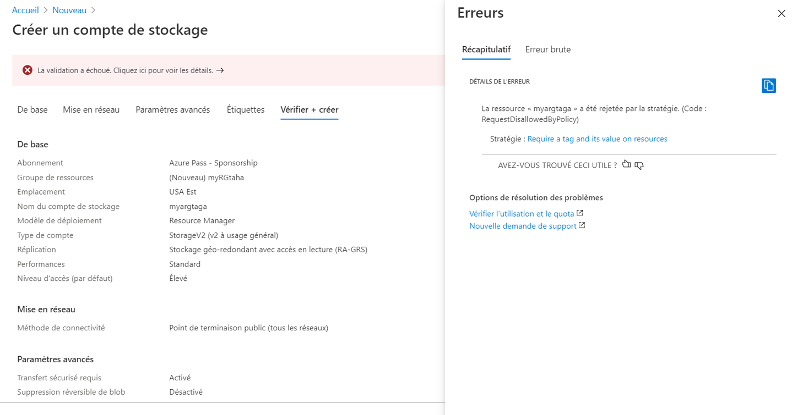
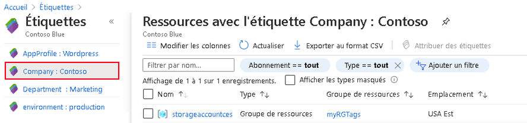
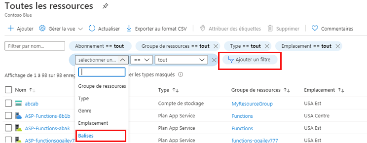

---
wts:
    title: '16 - Implémenter le balisage des ressources (5 min)'
    module: 'Module 05 : Description des fonctions d’identité, de gouvernance, de confidentialité et de conformité'
---
# 16 - Implémenter le balisage des ressources

Au cours de cette procédure pas à pas, nous allons créer une affectation de stratégie qui exige un balisage, créer un compte de stockage et tester le balisage, afficher les ressources avec une balise spécifique et supprimer la stratégie de balisage.

# Tâche 1 : Créer une affectation de stratégie (5 min)

Au cours de cette tâche, nous allons configurer la stratégie **Exiger une balise pour les ressources** et l’assigner à notre abonnement. 

1. Connectez-vous au [portail Azure](https://portal.azure.com).

2. Dans le panneau **Tous les services**, recherchez et sélectionnez **Stratégie**.

3. Faites défiler vers le bas jusqu’à la section **Création**, cliquez sur **Affectations**, puis sur **Attribuer une stratégie** en haut de la page.

4. Notez que la **Portée** de notre stratégie sera valable au niveau de l’abonnement. 

5. Sélectionnez le bouton affichant des points de suspension en regard de la zone **Définition de la stratégie** (fin de la zone de texte à droite). **Recherchez** les définitions de stratégie, y compris la **balise** de valeur, dans le jeu de résultats. Cliquez sur la définition **Exiger une balise pour les ressources**, puis sur **Sélectionner**.

   

6. Dans le panneau **Attribuer une stratégie**, sous l’onglet **Paramètres**, tapez **Entreprise** comme nom de balise. Cliquez sur **Examiner et créer**, puis sur **Créer**.

    **Remarque :** Ceci est un exemple simple de démonstration du balisage. 

    

7. L’attribution de la stratégie **Exiger une balise pour les ressources** est à présent en vigueur. Lorsqu’une ressource est créée, elle doit inclure une balise avec la clé Entreprise.

   

# Tâche 2 : Créer un compte de stockage pour tester le balisage requis

Au cours de cette tâche, nous allons créer des comptes de stockage pour tester le balisage requis. 

1. Dans le portail Azure, dans le panneau **Tous les services**, recherchez et sélectionnez **Comptes de stockage**, puis cliquez sur **+ Ajouter**.

2. Sous l’onglet **Informations de base** du panneau **Créer un compte de stockage**, remplissez les informations suivantes (remplacez **xxxx** dans le nom du compte de stockage par des lettres et des chiffres de sorte que le nom soit unique au monde). Laissez les valeurs par défaut pour tous les autres éléments.

    | Paramètre | Valeur | 
    | --- | --- |
    | Abonnement | **Utilisez votre abonnement** |
    | Groupe de ressources | **myRGTags** (nouveau) |
    | Nom du compte de stockage | **storageaccountxxxx** |
    | Emplacement | **(États-Unis) USA Est** |
    | | |

3. Cliquez sur **Examiner et créer**. 

    **Remarque :** Nous effectuons un test pour voir ce qui se passe lorsque la balise n’est pas fournie. 

4. Vous recevrez un message d’échec de validation. Cliquez sur le message **Cliquez ici pour afficher les détails**. Dans le panneau **Erreurs**, sous l’onglet **Sommaire**, notez le message d’erreur indiquant que la ressource a été refusée par la stratégie.

    **Remarque :** Si vous affichez l’onglet Erreur brute, vous verrez le nom de balise spécifique requis. 

    

    **Remarque : l’étiquetage peut prendre jusqu’à 30 minutes.** 

5. Fermez le volet **Erreur** et cliquez sur **Précédent** (au bas de l’écran). Fournissez les informations de balisage. 

    | Paramètre | Valeur | 
    | --- | --- |
    | Nom de la balise | **Entreprise** (peut ne pas figurer dans la liste déroulante) |
    | Valeur de la balise | **Contoso** |
    | | |

6. Cliquez sur **Examiner et créer** et vérifiez que la validation a réussi. Cliquez sur **Créer** pour déployer le compte de stockage. 

# Tâche 3 : Afficher toutes les ressources avec une balise spécifique

1. Dans le portail Azure, dans le panneau **Tous les services**, recherchez et sélectionnez **Balises**.

2. Notez toutes les balises et leurs valeurs. Cliquez sur la paire clé-valeur **Entreprise : **Paire clé-valeur **Contoso**. Un panneau présentant le compte de stockage nouvellement créé s’affiche, à condition que vous ayez inclus la balise lors de son déploiement. 

   

3. Dans le portail, affichez le panneau **Toutes les ressources**.

4. Cliquez sur **Ajouter un filtre** et ajoutez la clé de balise **Entreprise** comme catégorie de filtre. Une fois le filtre appliqué, seul votre compte de stockage est répertorié.

    

# Tâche 4 : Supprimer l’attribution de stratégie

Au cours de cette tâche, nous allons supprimer la stratégie **Exiger une balise pour les ressources** afin de ne pas affecter nos travaux suivants. 

1. Dans le portail, depuis le panneau **Tous les services**, recherchez et sélectionnez **Stratégie**.

2. Cliquez sur l’entrée de stratégie **Exiger une balise sur les ressources**.

3. Cliquez sur **Supprimer l’affectation** dans le menu principal.

4. Confirmez la suppression de l’affectation de stratégie dans la boîte de dialogue **Supprimer l’affectation** en cliquant sur **Oui**.

5. Si vous avez le temps, créez une autre ressource sans balise pour vous assurer que la stratégie n’est plus en vigueur.

Au cours de cette procédure pas à pas, nous avons créé une affectation de stratégie qui exige un balisage. Nous avons également créé un compte de stockage et testé le balisage, affiché les ressources avec une balise spécifique et supprimé la stratégie de balisage.

**Remarque** : Pour éviter des coûts supplémentaires, vous pouvez supprimer ce groupe de ressources. Recherchez des groupes de ressources, cliquez sur votre groupe de ressources, puis sur **Supprimer le groupe de ressources**. Vérifiez le nom du groupe de ressources, puis cliquez sur **Supprimer**. Surveillez les **notifications** pour voir comment se déroule la suppression.
