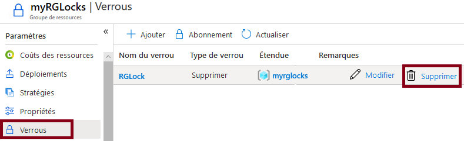

---
wts :
    title: '16 - Gérer les verrous de ressources'
    module: 'Module 03 : Sécurité, confidentialité, conformité et fiabilité'
---
# 16 - Gérer les verrous de ressources

Dans cette procédure pas à pas, nous allons créer un groupe de ressources, ajouter un verrou au groupe de ressources et tester la suppression d'une ressource dans le groupe de ressources, puis supprimer le verrou de ressource. 

# Tâche 1 : Créer un groupe de ressources

Au cours de cette tâche, nous allons créer un groupe de ressources pour cet exercice. 

1. Connectez-vous au [portail Azure](https://portal.azure.com).

2. Dans le panneau **Tous les services**, recherchez et sélectionnez **Groupes de ressources**, puis sélectionnez **+ Ajouter**.

3. Créez un nouveau groupe de ressources. Quand vous avez terminé, cliquez sur **Examiner et créer**, puis sur **Créer**. 

    | Paramètre | Valeur |
    | -- | -- |
    | Abonnement | **Utilisez votre abonnement** |
    | Nom | **myRGLocks** |
    | Région | **(États-Unis) USA Est** |
    | | |

# Tâche 2 :  Ajouter un verrou au groupe de ressources et tester la suppression

Au cours de cette tâche, nous allons ajouter un verrou de ressource au groupe de ressources et tester la suppression de ce groupe. 

1. Dans le portail Azure, accédez au nouveau groupe de ressources **myRGLocks**.

2. Vous pouvez appliquer un verrou à un abonnement, à un groupe de ressources ou à une ressource pour empêcher la suppression ou la modification accidentelle de ressources critiques. 

3. Dans la section **Paramètres**, cliquez sur **Verrous**, puis sur **+ Ajouter**. 

    

4. Configurez le nouveau verrou. Quand vous avez terminé, cliquez sur **OK**. 

    | Paramètre | Valeur |
    | -- | -- |
    | Nom du verrou | **RGLock** |
    | Type de verrou | **Supprimer** |
    | | |

5. Cliquez sur **Vue d’ensemble**, puis sur **Supprimer un groupe de ressources**. Tapez le nom du groupe de ressources, puis cliquez sur **OK**. Un message d’erreur s’affiche pour signaler que le groupe de ressources ne peut pas être supprimé, car il est verrouillé.

    

# Tâche 3 : Test de suppression d’un membre du groupe de ressources

Au cours de cette tâche, nous allons tester si le verrou de ressource protège un compte de stockage dans le groupe de ressources. 

1. Dans le panneau **Tous les services**, recherchez et sélectionnez **Comptes de stockage**, puis cliquez sur **Ajouter**. 

2. Sous l’onglet **Informations de base** du panneau **Créer un compte de stockage**, remplissez les informations suivantes (remplacez **xxxx** dans le nom du compte de stockage par des lettres et des chiffres de sorte que le nom soit unique au monde). Laissez les valeurs par défaut pour tous les autres éléments.

    | Paramètre | Valeur | 
    | --- | --- |
    | Abonnement | **Sélectionner votre abonnement** |
    | Groupe de ressources | **myRGLocks** |
    | Nom du compte de stockage | **storageaccountxxxx** |
    | Lieu | **(États-Unis) USA Est**  |
    | Performances | **Standard** |
    | Type de compte | **StorageV2 (usage général v2)** |
    | Réplication | **Stockage localement redondant (LRS)** |
    | Niveau d’accès (par défaut) | **Chaud** |
    | | |

3. Cliquez sur **Examiner et créer** pour réviser les paramètres de votre compte de stockage et autoriser Azure à valider la configuration. 

4. Une fois validé, cliquez sur **Créer**. Attendez de recevoir la notification indiquant que le compte a bien été créé. 

5.  Attendez la notification indiquant que le compte de stockage a bien été créé. 

6. Accédez à votre nouveau compte de stockage, puis, dans le volet **Vue d’ensemble**, cliquez sur **Supprimer**. Un message d’erreur s’affiche pour signaler que la ressource ou son parent a un verrou de suppression. 

    

    **Remarque** : Nous n’avons pas créé de verrou pour le compte de stockage, mais bien au niveau du groupe de ressources, qui contient le compte de stockage. Par conséquent, ce verrou de niveau *parent* nous empêche de supprimer la ressource, et le compte de stockage hérite du verrou du parent.

# Tâche 4 : Supprimer le verrou de ressource

Au cours de cette tâche, nous allons supprimer le verrou de ressource et effectuer un test. 

1. Revenez au panneau du groupe de ressources **myRGLocks** puis, dans la section **Paramètres**, cliquez sur **Verrous**.
    
2. Cliquez sur le lien **Supprimer** situé à droite de l’entrée **RGLock**.

    

3. Revenez au panneau du compte de stockage et vérifiez que vous pouvez à présent supprimer la ressource.

Félicitations ! Vous avez créé un groupe de ressources, ajouté un verrou au groupe de ressources et testé la suppression, testé la suppression d’une ressource dans le groupe de ressources et supprimé le verrou de ressource. 

**Remarque** : Pour éviter des coûts supplémentaires, vous pouvez supprimer ce groupe de ressources. Recherchez des groupes de ressources, cliquez sur votre groupe de ressources, puis sur **Supprimer le groupe de ressources**. Vérifiez le nom du groupe de ressources, puis cliquez sur **Supprimer**. Surveillez les **notifications** pour voir comment se déroule la suppression.