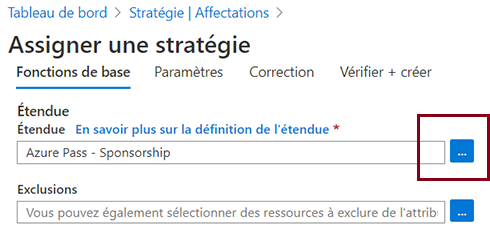
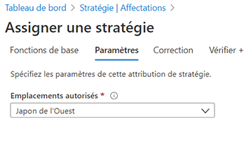

---
wts:
    title: '17 - Créer une stratégie Azure (10 minutes)'
    module: 'Module 05 : Description des fonctionnalités d’identité, de gouvernance, de confidentialité et de conformité'
---
# 17 - Créer une stratégie Azure

Dans cette procédure pas à pas, nous allons créer une stratégie Azure Policy pour limiter le déploiement des ressources Azure à un emplacement spécifique.

# Tâche 1 : Créer une affectation de stratégie (10 minutes)

Au cours de cette tâche, nous allons configurer la stratégie d’emplacements autorisés et l’affecter à notre abonnement. 

1. Connectez-vous au [portail Azure](https://portal.azure.com).

2. Dans le panneau **Tous les services**, recherchez et sélectionnez **Stratégie**, puis, dans la section **Création**, cliquez sur **Définitions**.  Prenez quelques instants pour passer en revue la liste des définitions de stratégie intégrées. Par exemple, dans la liste déroulante **Catégorie**, sélectionnez uniquement **Compute**. La définition **SKU de machine virtuelle autorisés** permet de spécifier un ensemble de références de machine virtuelle que votre organisation peut déployer.

3. Revenez à la page **Stratégie**, puis, dans la section **Création**, cliquez sur **Affectations**. Une affectation est une stratégie qui a été affectée pour être appliquée dans une étendue spécifique. Par exemple, une définition peut être attribuée à l’étendue de l’abonnement. 

4. Cliquez sur **Affecter une stratégie** en haut de la page **Stratégie - Affectations**.

5. Sur la page **Assigner une stratégie**, choisissez le sélecteur Étendue en cliquant sur les points de suspension.

    

6. Assurez-vous que votre abonnement est sélectionné. Le nom de votre abonnement peut être différent. Vous pouvez éventuellement étendre la stratégie à un groupe de ressources. Conservez les valeurs par défaut, puis cliquez sur **Sélectionner**. 

    **Remarque** : Une étendue détermine les ressources ou le regroupement de ressources auquel l’affectation de stratégie s’applique. Dans notre cas, nous pourrions attribuer cette stratégie à un groupe de ressources spécifique, mais nous avons choisi de l’affecter au niveau de l’abonnement. N’oubliez pas que des ressources peuvent être exclues en fonction de la configuration de l’étendue. Les exclusions sont facultatives.

    

7. Sélectionnez les points de suspension affichés en regard de la zone **Définition de la stratégie**. Dans la zone **Rechercher**, tapez **emplacement**, cliquez sur la définition **Emplacements autorisés**, puis cliquez sur **Sélectionner**.

    **Remarque** : Cette définition de stratégie **Emplacements autorisés** spécifie un emplacement dans lequel toutes les ressources doivent être déployées. Si un autre emplacement est choisi, le déploiement ne sera pas autorisé. Pour plus d’informations, consultez la page [Exemples Azure Policy](https://docs.microsoft.com/fr-fr/azure/governance/policy/samples/index).

   

8.  Dans le volet **Assigner une stratégie**, basculez vers l’onglet **Paramètres**, cliquez sur la flèche à la fin de la zone **Emplacements autorisés**, puis, dans la liste qui s’affiche, choisissez **Ouest du Japon**. Laissez toutes les autres valeurs telles quelles, cliquez sur **Vérifier + créer**, puis sur **Créer**.

    

9. L’affectation de stratégie **Emplacements autorisés** est à présent répertoriée dans le volet **Stratégie - Affectations** et applique la stratégie au niveau d’étendue spécifié (Abonnement).

# Tâche 2 : Tester la stratégie de localisation autorisée

Dans cette tâche, nous allons tester la stratégie de localisation autorisée. 

1. Dans le portail Azure, dans le panneau **Tous les services**, recherchez et sélectionnez **Comptes de stockage**, puis cliquez sur **+ Ajouter**.

2. Configurez le compte de stockage (remplacez **xxxx** dans le nom du compte de stockage par des lettres et des chiffres afin que le nom soit unique au monde). Laissez les valeurs par défaut pour tous les autres éléments. 

    | Paramètre | Valeur | 
    | --- | --- |
    | Abonnement | **Utilisez votre abonnement** |
    | Groupe de ressources | **myRGPolicy** (création) |
    | Nom du compte de stockage | **storageaccountxxxx** |
    | Lieu | **(États-Unis) USA Est** |
    | | |

3. Cliquez sur **Vérifier + créer**, puis cliquez sur **Créer**. 

4. Une erreur d’échec du déploiement s’affiche pour signaler que la ressource a été rejetée par la stratégie, y compris le nom de stratégie **Emplacements autorisés**.

# Tâche 3 : Supprimer l’attribution de stratégie

Dans cette tâche, nous allons supprimer l’affectation et le test de la stratégie de localisation autorisée. 

Nous allons supprimer l’affectation de stratégie pour ne pas risquer d’être bloqués lors d’une tâche ultérieure.

1. Dans le panneau **Tous les services**, recherchez et sélectionnez **Stratégie**, puis cliquez sur votre stratégie **Emplacements autorisés**.

    **Remarque** : Dans le panneau **Stratégie**, vous pouvez consulter l’état de conformité des différentes stratégies que vous avez affectées.

    **Remarque** : La stratégie Emplacements autorisés peut afficher des ressources non conformes. Dans ce cas, il s’agit de ressources créées avant l’affectation de stratégie.

2. Cliquez sur **Supprimer l’affectation** dans le menu supérieur.

   

3. Confirmez la suppression de l’affectation de stratégie dans la boîte de dialogue **Supprimer l’affectation** en cliquant sur **Oui**.

4. Essayez de créer un autre compte de stockage pour vous assurer que la stratégie n’est plus appliquée.

    **Remarque** : Voici quelques scénarios courants où la stratégie **Emplacements autorisés** peut être utile : 
    - *Suivi des coûts* : Vous pourriez avoir plusieurs abonnements pour différents emplacements régionaux. La stratégie garantit que toutes les ressources sont déployées dans la région prévue pour faciliter le suivi des coûts. 
    - *Résidence des données et conformité de la sécurité* : Vous pourriez également avoir des besoins en matière de résidence des données, créer des abonnements par client ou des charges de travail spécifiques, et déterminer que toutes les ressources doivent être déployées dans un centre de données particulier pour garantir le respect des exigences relatives à la conformité des données et de la sécurité.

Félicitations ! Vous avez créé une Azure Policy pour limiter le déploiement des ressources Azure à un centre de données particulier.

**Remarque** : Pour éviter des coûts supplémentaires, vous pouvez supprimer ce groupe de ressources. Recherchez des groupes de ressources, cliquez sur votre groupe de ressources, puis sur **Supprimer le groupe de ressources**. Vérifiez le nom du groupe de ressources, puis cliquez sur **Supprimer**. Surveillez les **notifications** pour voir comment se déroule la suppression.
