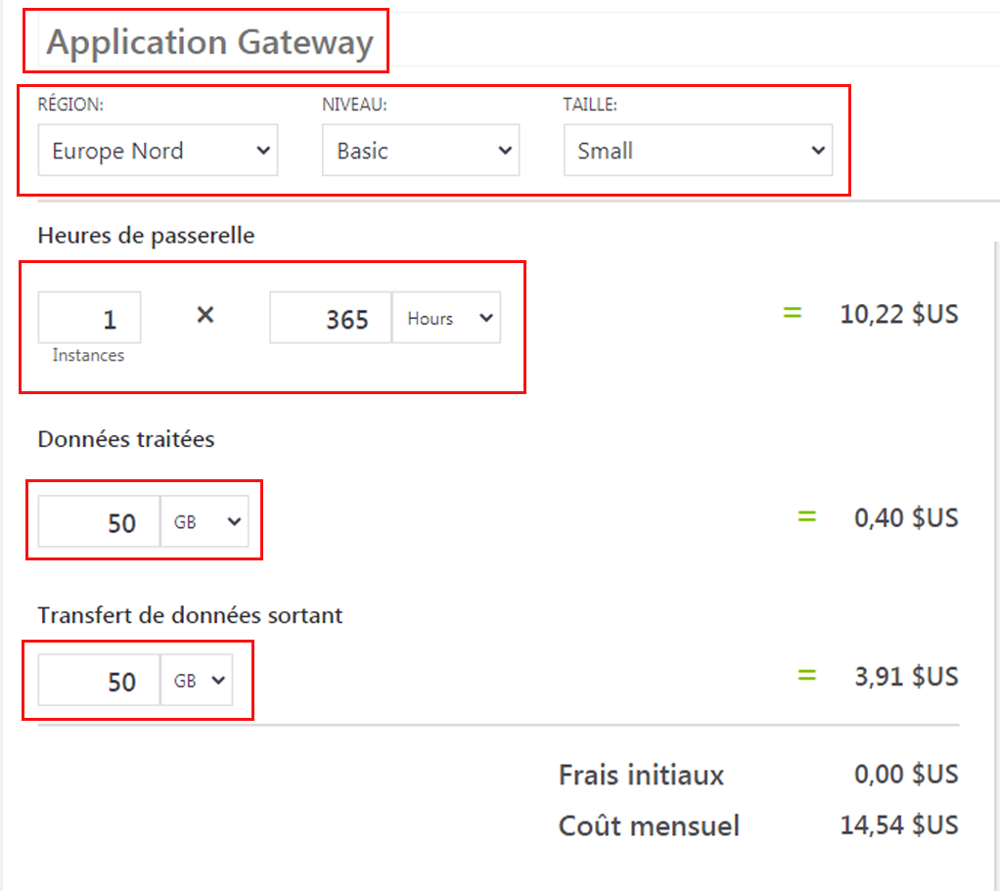
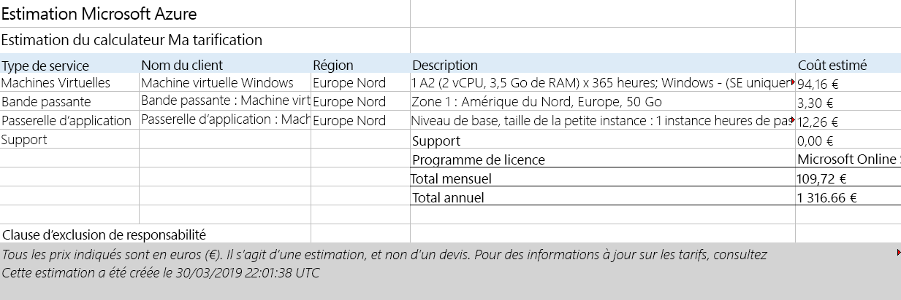

---
wts:
    title: '19 - Utiliser la calculatrice de prix Azure (10 minutes)'
    module: 'Module 06 : Description de la gestion des coûts Azure et des contrats de niveau de service'
---
# 19 - Utilisation du calculateur de prix appliqués

Dans cette procédure pas à pas, nous utiliserons la calculatrice de prix Azure pour générer une estimation des coûts pour une machine virtuelle Azure et les ressources réseau associées.

# Tâche 1 : Configurer la calculatrice de prix (10 minutes)

Dans cette tâche, nous allons estimer le coût d’un échantillon d’infrastructure à l’aide de la calculatrice de prix Azure. 

**Remarque** : Pour créer une estimation de la calculatrice de prix Azure, cette procédure pas à pas donne des exemples de configurations pour la machine virtuelle et les ressources associées. Utilisez cet exemple de configurations ou fournissez au calculateur de prix appliqués Azure des détails sur vos besoins *réels* en ressources.

1. Dans un navigateur, accédez à la page Web [Calculateur de prix appliqués Azure](https://azure.microsoft.com/fr-fr/pricing/calculator/).

2. Pour ajouter des détails sur votre configuration de machine virtuelle, cliquez sur **Machines virtuelles**, sous l’onglet **Produits**. Faites défiler vers le bas pour afficher les détails de la machine virtuelle. 

3. Remplacez le texte **Votre estimation** et **Machines virtuelles** avec des noms plus descriptifs pour votre estimation du calculateur de prix appliqués Azure et votre configuration de machine virtuelle. Cet exemple pas à pas utilise **Mon estimation de la calculatrice de prix** pour l’estimation, et **Machine virtuelle Windows** pour la configuration de la machine virtuelle.

   

4. Modifiez la configuration de la machine virtuelle par défaut.

    | Région | Système d’exploitation | Type |
    |------|----------------|----|
    | Europe Nord | Windows | (OS uniquement) |
    | | |

    | Niveau | Instance |
    |----|--------|
    | Standard | A2 : 2 cœurs, 3,5 Go de RAM, 135 Go de stockage temporaire |
    | | |

   

    **Remarque** : Les spécifications et les prix appliqués des instances de machine virtuelle peuvent différer de ceux de cet exemple. Suivez cette procédure pas à pas en choisissant une instance qui correspond le plus possible à l'exemple. Pour afficher les détails des différentes options de machine virtuelle, choisissez **Détails du produit** dans le menu **Plus d’informations** affiché dans le volet de droite.

5. Définissez la valeur de l’option **Facturation** sur **Paiement à l’utilisation**.

   

6. Dans Azure, un mois est défini comme 730 heures. Si votre machine virtuelle doit être disponible 100 %du temps chaque mois, vous devez définir la valeur des heures par mois sur `730`. Cet exemple pas à pas nécessite qu’une machine virtuelle soit disponible 50 % du temps chaque mois.

    Laissez le nombre de machines virtuelles défini sur `1` et modifiez la valeur des heures par mois sur `365`.

   

7. Dans le volet **Disques de système d'exploitation gérés**, modifiez la configuration de stockage de la machine virtuelle par défaut.

    | Niveau | Taille du disque | Nombre de disques | Instantané | Transactions de stockage |
    | ---- | --------- | --------------- | -------- | -------------------- |
    | HDD Standard | S30 : 1024 Gio | 1 | Désactivé | 10 000 |

   

8. Pour ajouter de la bande passante de mise en réseau à votre estimation, accédez au haut de la page Web Calculateur de prix appliqués Azure. Cliquez sur **Mise en réseau** dans le menu produit à gauche, puis cliquez sur la mosaïque **Bande passante**. Dans la boîte de dialogue **Bande passante ajoutée**, cliquez sur **Vue**.

   

9. Ajoutez un nom pour votre configuration de bande passante de la machine virtuelle. Cet exemple pas à pas utilise le nom **Bande passante : Machine virtuelle Windows**. Modifiez la configuration de bande passante par défaut en ajoutant les détails suivants.

    | Région | Montant du transfert de données sortantes de la zone 1 |
    | ------ | -------------------------------------- |
    | Europe Nord | 50 Mo |

   

10. Pour ajouter une Application Gateway, revenez en haut de la page Web de la calculatrice de prix appliqués Azure. Dans le menu de produit **Mise en réseau**, cliquez sur la mosaïque **Application Gateway**. Dans la boîte de dialogue **Application Gateway**, cliquez sur **Vue**.

    

11. Ajoutez un nom pour votre configuration Application Gateway. Cette procédure pas à pas utilise le nom **App Gateway : Machine virtuelle Windows**. Modifiez la configuration Application Gateway par défaut en ajoutant les détails suivants.

    | Région | Niveau | Taille |
    | ------ | ---- | ---- |
    | Europe Nord | De base | Petite |
    | | |

    | Instances | Heures |
    | ------- | ------- |
    | 1 | 365 |
    | | |

    | Données traitées |
    | -------------- |
    | 50 Mo |
    | | |

    | Zone 1 : Amérique du Nord, Europe |
    | ----------------------------- |
    | 50 Mo |
    | | |

    

# Tâche 2 : Revoir l’estimation des prix appliqués

Dans cette tâche, nous allons examiner les résultats de la calculatrice de prix appliqués Azure. 

1. Faites défiler vers le bas de la page Web de la calculatrice de prix appliqués Azure pour afficher le total du **Coût mensuel estimé**.

    **Remarque** : Explorez les différentes options disponibles dans la calculatrice de prix Azure. Par exemple, cette procédure pas à pas vous oblige à mettre à jour la devise en Euro.

2. Modifiez la devise en Euro, puis sélectionnez **Exporter** pour télécharger une copie de l’estimation pour une consultation hors ligne au format Microsoft Excel (`.xlsx`).

    

    

Félicitations ! Vous avez téléchargé une estimation à partir de la calculatrice de prix Azure.