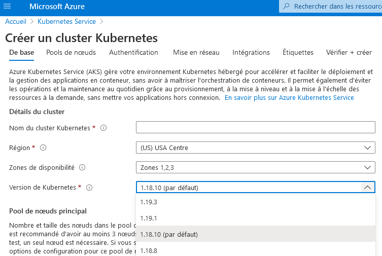
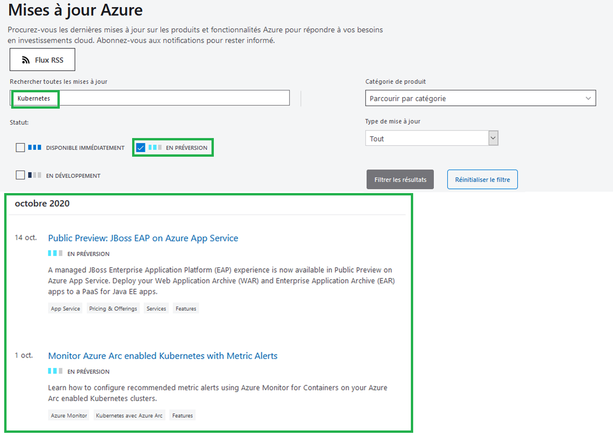

---
wts:
    title: '23 - Accéder aux préversions de fonctionnalités Azure'
    module: 'Module 04 - Tarification et assistance Azure'
---

# 23 - Accéder aux préversions de fonctionnalités Azure

Dans cette procédure pas à pas, nous allons accéder aux préversions des services et fonctionnalités Azure et les identifier, puis afficher des informations sur les dernières mises à jour Azure.

# Tâche 1 : Accéder aux services et fonctionnalités de prévisualisation

Dans cette tâche, nous allons passer en revue les fonctionnalités de Marketplace. 

1. Connectez-vous au [portail Azure](https://portal.azure.com).

2. Dans le panneau **Tous les services**, recherchez et sélectionnez **Marketplace (Place de marché)**. 

3. Recherchez **Préversion** dans Marketplace. Passez en revue les préversions de produits qui vous intéressent. 

4. Recherchez **Service Kubernetes** dans Marketplace. Sélectionnez le service Kubernetes et cliquez sur **Créer**.

5. Dans la liste déroulante de la **version Kubernetes**, vous trouverez une **préversion**. Tous les services ne disposent pas de préversion. 

    

    **Remarque**: Dans ces scénarios, où de nouvelles fonctionnalités sont publiées dans un service ou produit Azure existant et généralement disponible, bien que vous utilisiez le service Azure en production, il se peut que la préversion de fonctionnalité ne soit pas encore prête pour les déploiements de production. Vous devez vous assurer que vous êtes au courant des limitations concernant l’utilisation des versions d’évaluation avant de les déployer en production.

# Tâche 2 : Consulter la page des mises à jour Azure

Dans cette tâche, nous allons consulter la page des mises à jour Azure.

1. Dans un navigateur, accédez à la page [Mises à jour Azure](https://azure.microsoft.com/fr-fr/updates/). 

2. Notez la présence des options de filtre basées sur l’état, nommées **Maintenant disponible**, **En préversion** et **En développement**.

3. Activez la case à cocher **En préversion**, tapez **Kubernetes** dans la zone de texte Recherche par mot-clé, puis appuyez sur la touche **Entrée**. 

    **Remarque**: La page renvoie une liste d’éléments en préversion liés à Kubernetes. Votre liste de résultats peut être différente. 

    

4. Cliquez sur n’importe quel élément de la liste des résultats pour obtenir des informations plus détaillées. 

5. Retournez à la page **Mises à jour Azure**, affichez les éléments qui ont désormais le statut **Disponibilité générale** en activant la case à cocher **Maintenant disponible** et en désactivant la case à cocher **En préversion**. Passez en revue tous les articles retournés par la recherche qui vous intéressent.

6. Retournez à la page **Mises à jour Azure**, activez la case à cocher **En développement** et désactivez la case à cocher  **Maintenant disponible**. Passez en revue tous les articles retournés par la recherche qui vous intéressent.

Félicitations ! Vous avez accédé à et identifié les services et fonctionnalités de prévisualisation Azure, et consulté les dernières informations de mises à jour Azure.

